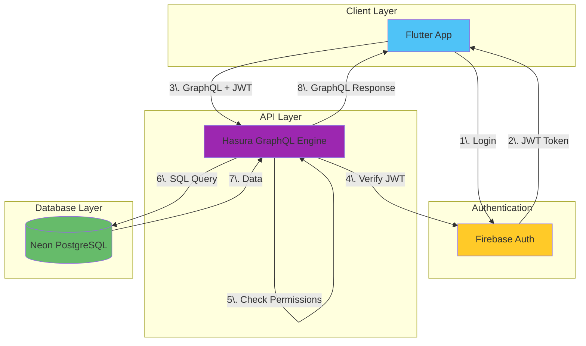
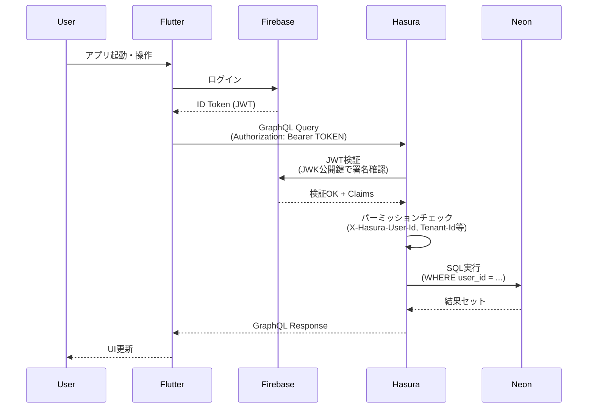
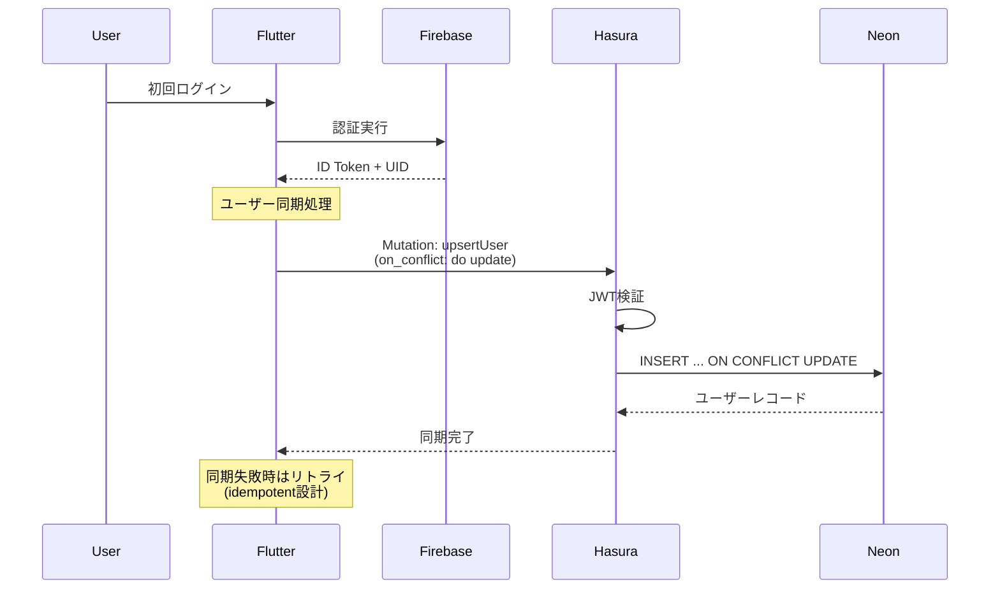
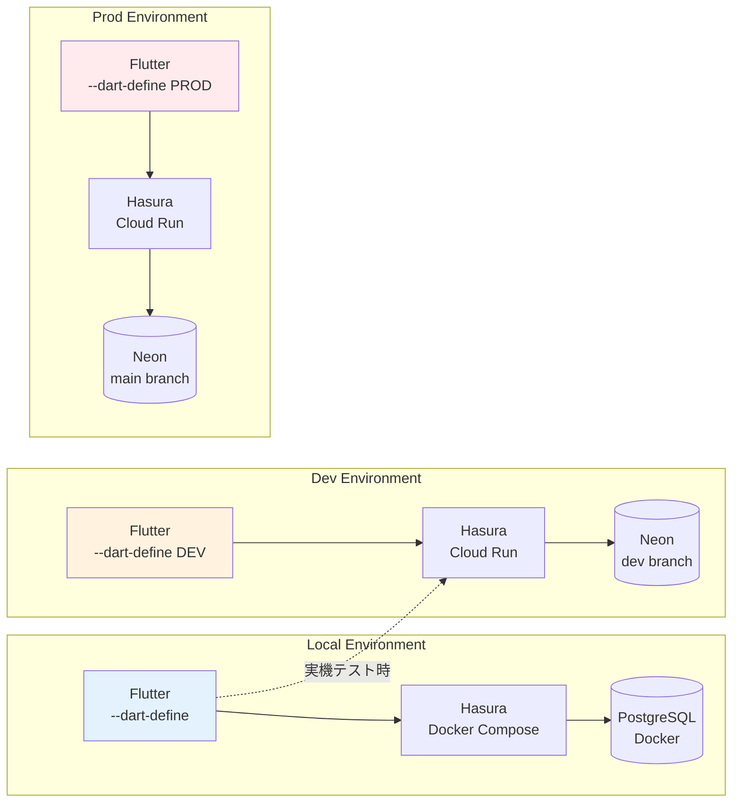
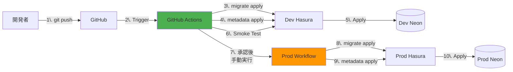
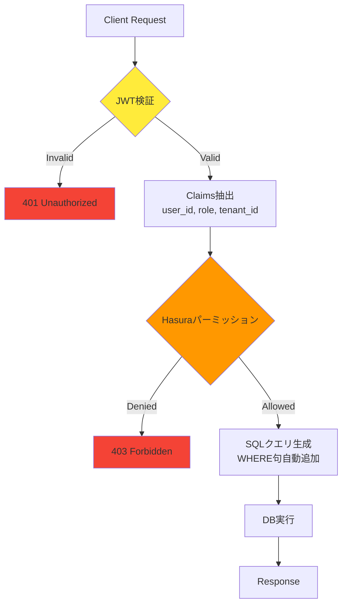

# アーキテクチャ概要

このドキュメントでは、本プロジェクトのシステム全体像と各コンポーネントの責務を説明します。

## システム全体図

## コンポーネント責務

### 1. Flutter App（クライアント）

**役割**:
- ユーザーインターフェース
- Firebase Auth によるユーザー認証
- GraphQL クエリ・ミューテーションの実行
- 型安全なデータ操作（graphql_codegen使用）

**技術スタック**:
- Flutter SDK 3.10+
- `graphql_flutter` - GraphQLクライアント
- `graphql_codegen` - 型生成
- `firebase_auth` - 認証

**責務の範囲**:
- ビジネスロジックの一部（UI状態管理、バリデーション）
- 認証トークンの管理とリフレッシュ
- GraphQLリクエストへのJWT自動付与

### 2. Firebase Auth（認証基盤）

**役割**:
- ユーザー登録・ログイン管理
- JWT（IDトークン）の発行
- カスタムクレーム（ロール情報）の管理

**採用理由**:
- マネージドサービスで運用コスト低
- モバイルSDKが充実
- メール/Google/Apple等の認証プロバイダが統合済み
- Hasura と標準的な連携パターンが確立

**責務の範囲**:
- 認証のみ（認可はHasuraが担当）
- ユーザーのプロファイル情報は **Neon DB の users テーブル** で管理

### 3. Hasura GraphQL Engine（API層）

**役割**:
- GraphQL API の自動生成
- 認可（パーミッション制御）
- マイグレーション・メタデータ管理
- リアルタイムサブスクリプション

**機能**:
- **JWTベース認証**: Firebase の IDトークン を検証
- **行レベルセキュリティ**: Hasuraパーミッションで `X-Hasura-User-Id`、`X-Hasura-Tenant-Id` 等をチェック
- **スキーマ自動生成**: DB構造から GraphQL スキーマを自動生成
- **リレーション**: 外部キーから GraphQL のネスト構造を自動作成

**デプロイ先**:
- **local**: Docker Compose
- **dev/prod**: Cloud Run

**責務の範囲**:
- API エンドポイント提供
- 認可ルールの適用
- クエリの最適化（N+1問題の回避等）

### 4. Neon PostgreSQL（データ層）

**役割**:
- アプリケーションデータの永続化
- トランザクション管理
- 全文検索、集計等のDB機能提供

**採用理由**:
- サーバレスPostgreSQL（従量課金）
- **ブランチ機能**で環境分離が容易
- スケーリング自動対応
- バックアップ・PITR（ポイントインタイムリカバリ）標準装備

**ブランチ構成**:
- **main（prod）**: 本番データ
- **dev**: 開発・統合テスト用
- **local**: Docker Postgres（Neon使わない選択肢もあり）

**責務の範囲**:
- データの保存・取得
- 整合性制約の維持
- インデックスによるパフォーマンス最適化

## データフロー

### 通常のクエリ実行フロー

### 初回ログイン時のユーザー同期フロー

## 環境構成図

### 環境の使い分け

| 環境 | 用途 | DB | Hasura | Flutter向き先 |
|------|------|----|---------|----|
| **local** | 開発・migration作成・安全な実験場 | Docker PostgreSQL | Docker Compose | dev（実機テスト時） |
| **dev** | 統合検証・実機テスト | Neon dev branch | Cloud Run | dev |
| **prod** | 本番運用 | Neon main branch | Cloud Run | prod |

詳細は [環境構成ドキュメント](environment.md) を参照。

## CI/CD パイプライン概要

詳細は [デプロイフロー](deployment.md) を参照。

## セキュリティレイヤー

**多層防御**:
1. **Firebase JWT検証**: 署名・有効期限・issuer/audienceチェック
2. **Hasuraパーミッション**: ロール・ユーザーID・テナントIDでフィルタリング
3. **（オプション）PostgreSQL RLS**: Hasura経由以外のアクセスに備えた二重防御

詳細は [認証・認可ドキュメント](authentication.md) を参照。

## スケーラビリティ戦略

### 現在の構成
- **Hasura**: Cloud Run でオートスケール
- **Neon**: サーバレスDB（自動スケール）
- **Firebase Auth**: フルマネージド（制限なし）

### 将来の拡張ポイント
- **キャッシュ層**: Redis（頻繁にアクセスされるデータ）
- **CDN**: Cloud CDN（静的アセット）
- **Read Replica**: Neon の読み取りレプリカ（分析クエリ分離）
- **Materialized View**: 集計処理の高速化

## まとめ

このアーキテクチャの特徴：

- **マネージドサービス中心**: 運用負荷を最小化
- **疎結合**: 各レイヤーが独立して変更可能
- **型安全**: DB → Hasura → Flutter まで一貫した型定義
- **環境分離**: local/dev/prod で安全な開発サイクル
- **拡張性**: 初期は最小構成、必要に応じて機能追加

次は [設計原則・決定事項](design-principles.md) で具体的な実装方針を確認してください。
