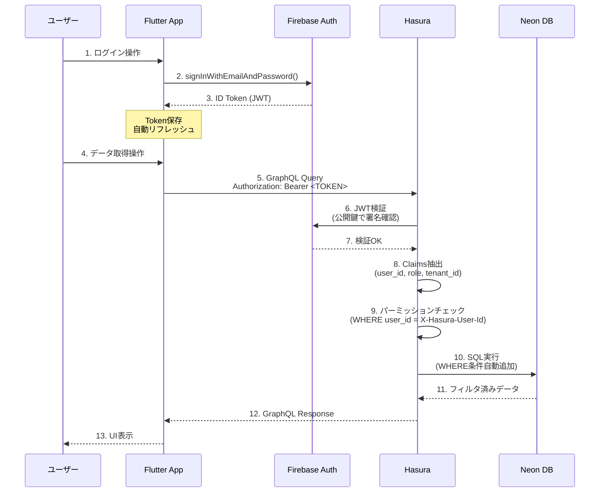
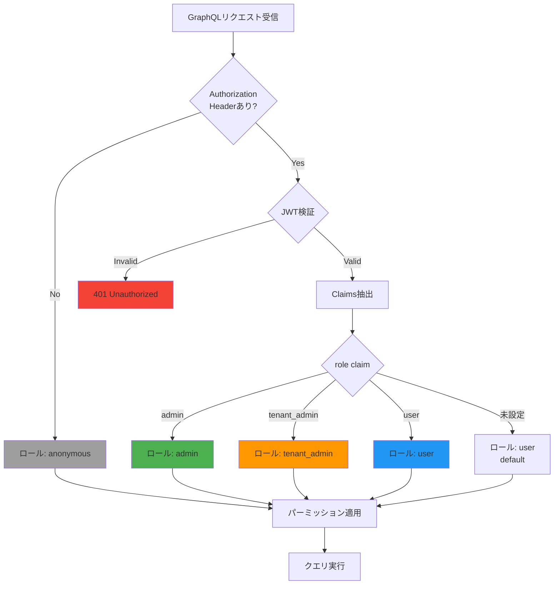
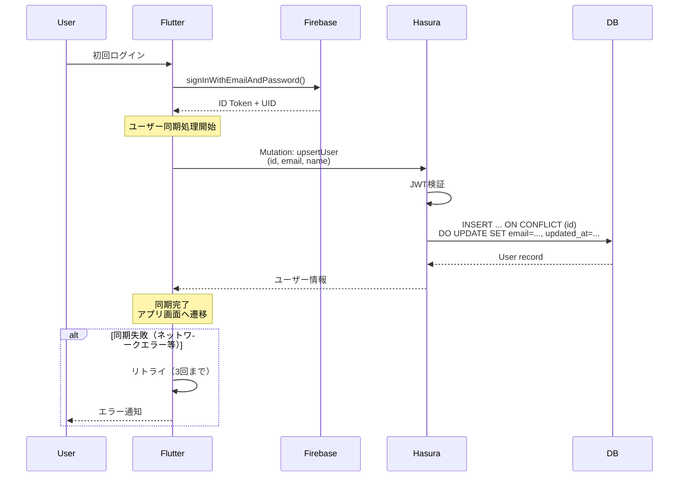
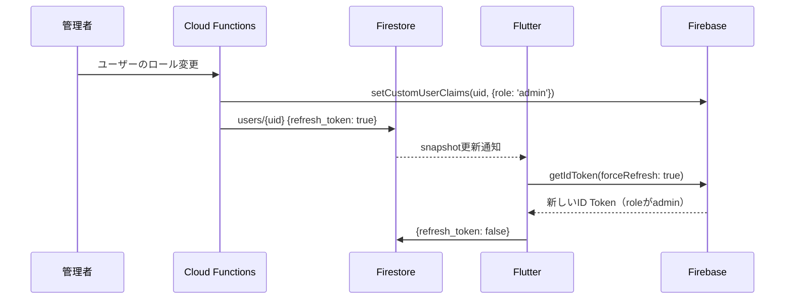

# 認証・認可

このドキュメントでは、Firebase Auth × Hasura による認証・認可の仕組みを詳しく説明します。

## 認証・認可の分離

| 層 | 担当 | 役割 |
|----|------|------|
| **認証（Authentication）** | Firebase Auth | ユーザーが誰かを特定（JWT発行） |
| **認可（Authorization）** | Hasura | ユーザーが何をできるかを制御（パーミッション） |

## 全体フロー



---

## Firebase Auth 設定

### プロジェクト構成

| 環境 | Firebase Project ID | 認証プロバイダ |
|------|-------------------|-------------|
| **dev** | `myproject-dev` | Email/Password, Google |
| **prod** | `myproject-prod` | Email/Password, Google, Apple |

### 認証プロバイダ有効化

1. Firebase Console → Authentication → Sign-in method
2. 以下を有効化：
   - **Email/Password**: 基本認証
   - **Google**: ソーシャルログイン
   - **Apple**: iOS必須（App Store審査要件）

### Custom Claims（カスタムクレーム）

**役割（role）の設定**:
```javascript
// Cloud Functions または Admin SDK で設定
const admin = require('firebase-admin');

await admin.auth().setCustomUserClaims(uid, {
  role: 'user',           // 'user' | 'tenant_admin' | 'admin'
  tenant_id: 'org-123',   // マルチテナント対応
});
```

**JWT に含まれる Claims 例**:
```json
{
  "iss": "https://securetoken.google.com/myproject-dev",
  "aud": "myproject-dev",
  "auth_time": 1640000000,
  "user_id": "abc123",
  "sub": "abc123",
  "iat": 1640000000,
  "exp": 1640003600,
  "email": "user@example.com",
  "email_verified": true,
  "role": "user",
  "tenant_id": "org-123"
}
```

---

## Hasura JWT 設定

### JWT Secret 設定（環境変数）

**Dev/Prod共通形式**:
```json
{
  "type": "RS256",
  "jwk_url": "https://www.googleapis.com/service_accounts/v1/jwk/securetoken@system.gserviceaccount.com",
  "issuer": "https://securetoken.google.com/<PROJECT_ID>",
  "audience": "<PROJECT_ID>",
  "claims_map": {
    "x-hasura-allowed-roles": {
      "path": "$.role",
      "default": ["user"]
    },
    "x-hasura-default-role": {
      "path": "$.role",
      "default": "user"
    },
    "x-hasura-user-id": {
      "path": "$.user_id"
    },
    "x-hasura-tenant-id": {
      "path": "$.tenant_id"
    }
  }
}
```

**環境ごとの差分**:
- **Dev**: `"issuer": "https://securetoken.google.com/hasura-flutter-dev"`, `"audience": "hasura-flutter-dev"`
- **Prod**: `"issuer": "https://securetoken.google.com/hasura-flutter-prod"`, `"audience": "hasura-flutter-prod"`

### 環境変数設定例

**Local環境（backend/.env）**:
```bash
# Dev用の設定（hasura-flutter-dev）
HASURA_GRAPHQL_JWT_SECRET={"type":"RS256","jwk_url":"https://www.googleapis.com/service_accounts/v1/jwk/securetoken@system.gserviceaccount.com","issuer":"https://securetoken.google.com/hasura-flutter-dev","audience":"hasura-flutter-dev","claims_map":{"x-hasura-allowed-roles":{"path":"$.role","default":["user"]},"x-hasura-default-role":{"path":"$.role","default":"user"},"x-hasura-user-id":{"path":"$.user_id"},"x-hasura-tenant-id":{"path":"$.tenant_id"}}}
```

**Cloud Run（Secret Manager）**:
```bash
# Dev環境
HASURA_GRAPHQL_JWT_SECRET='{"type":"RS256","jwk_url":"https://www.googleapis.com/service_accounts/v1/jwk/securetoken@system.gserviceaccount.com","issuer":"https://securetoken.google.com/hasura-flutter-dev","audience":"hasura-flutter-dev","claims_map":{"x-hasura-allowed-roles":{"path":"$.role","default":["user"]},"x-hasura-default-role":{"path":"$.role","default":"user"},"x-hasura-user-id":{"path":"$.user_id"},"x-hasura-tenant-id":{"path":"$.tenant_id"}}}'

# Prod環境
HASURA_GRAPHQL_JWT_SECRET='{"type":"RS256","jwk_url":"https://www.googleapis.com/service_accounts/v1/jwk/securetoken@system.gserviceaccount.com","issuer":"https://securetoken.google.com/hasura-flutter-prod","audience":"hasura-flutter-prod","claims_map":{"x-hasura-allowed-roles":{"path":"$.role","default":["user"]},"x-hasura-default-role":{"path":"$.role","default":"user"},"x-hasura-user-id":{"path":"$.user_id"},"x-hasura-tenant-id":{"path":"$.tenant_id"}}}'
```

**設定手順**:
1. 上記のJWT Secretを`backend/.env`に設定
2. Docker Compose を再起動: `docker compose restart hasura`
3. Hasuraログで検証: `docker compose logs hasura | grep JWT`

---

## ロール設計

### 4つのロール

| ロール | 用途 | 権限 |
|--------|------|------|
| **anonymous** | 未ログイン状態 | 公開データの参照のみ |
| **user** | 一般ユーザー | 自身のデータCRUD、他人のデータ参照（一部） |
| **tenant_admin** | テナント管理者 | 自分のテナント内の全データへのアクセス |
| **admin** | システム管理者 | 全テナントの全データへのアクセス |

### ロール判定フロー



---

## Hasura パーミッション設定

### 基本パターン

#### 1. `users` テーブル（自分のデータのみ）

**user ロール - select**:
```json
{
  "filter": {
    "_and": [
      {"id": {"_eq": "X-Hasura-User-Id"}},
      {"deleted_at": {"_is_null": true}}
    ]
  },
  "columns": ["id", "email", "name", "created_at", "updated_at"]
}
```

**user ロール - update**:
```json
{
  "filter": {
    "id": {"_eq": "X-Hasura-User-Id"}
  },
  "columns": ["name", "updated_at"],
  "set": {
    "updated_at": "now()",
    "updated_by": "X-Hasura-User-Id"
  }
}
```

**tenant_admin ロール - select**:
```json
{
  "filter": {
    "tenant_id": {"_eq": "X-Hasura-Tenant-Id"}
  },
  "columns": "*"  // 全カラム（deleted_at含む）
}
```

**admin ロール - select**:
```json
{
  "filter": {},  // 制限なし（全テナント）
  "columns": "*"  // 全カラム
}
```

#### 2. `posts` テーブル（マルチテナント対応）

**user ロール - select**:
```json
{
  "filter": {
    "_and": [
      {"tenant_id": {"_eq": "X-Hasura-Tenant-Id"}},
      {"deleted_at": {"_is_null": true}},
      {
        "_or": [
          {"status": {"_eq": "published"}},
          {"user_id": {"_eq": "X-Hasura-User-Id"}}
        ]
      }
    ]
  }
}
```

**説明**:
- 同じテナント内のデータのみ
- 公開済み（published）または自分の投稿のみ閲覧可能

**user ロール - insert**:
```json
{
  "check": {
    "tenant_id": {"_eq": "X-Hasura-Tenant-Id"}
  },
  "columns": ["title", "content", "status"],
  "set": {
    "user_id": "X-Hasura-User-Id",
    "tenant_id": "X-Hasura-Tenant-Id",
    "created_at": "now()",
    "updated_at": "now()",
    "created_by": "X-Hasura-User-Id",
    "updated_by": "X-Hasura-User-Id"
  }
}
```

**user ロール - update**:
```json
{
  "filter": {
    "_and": [
      {"user_id": {"_eq": "X-Hasura-User-Id"}},
      {"tenant_id": {"_eq": "X-Hasura-Tenant-Id"}}
    ]
  },
  "columns": ["title", "content", "status"],
  "set": {
    "updated_at": "now()",
    "updated_by": "X-Hasura-User-Id"
  }
}
```

**user ロール - delete**:
```json
{
  "filter": {
    "_and": [
      {"user_id": {"_eq": "X-Hasura-User-Id"}},
      {"tenant_id": {"_eq": "X-Hasura-Tenant-Id"}}
    ]
  }
}
```

**注**: 実際はソフトデリート（update で `deleted_at` をセット）を推奨

---

## ユーザー同期戦略

### 初回ログイン時の同期

Firebase Auth にはユーザーの基本情報のみが保存されます。アプリケーション固有のユーザー情報（プロフィール、設定等）は **Neon DB の `users` テーブル** で管理します。

### 同期フロー



### Idempotent Upsert（GraphQL）

```graphql
mutation UpsertUser($id: uuid!, $email: String!, $name: String) {
  insert_users_one(
    object: {
      id: $id
      email: $email
      name: $name
      created_at: "now()"
      updated_at: "now()"
    }
    on_conflict: {
      constraint: users_pkey
      update_columns: [email, name, updated_at]
    }
  ) {
    id
    email
    name
    created_at
  }
}
```

**ポイント**:
- `on_conflict` で既存ユーザーは更新のみ（idempotent）
- 何度実行しても同じ結果（リトライ安全）

### Flutter実装例

```dart
// lib/services/auth_service.dart
import 'package:firebase_auth/firebase_auth.dart';
import 'package:graphql_flutter/graphql_flutter.dart';

class AuthService {
  final FirebaseAuth _firebaseAuth = FirebaseAuth.instance;
  final GraphQLClient _graphqlClient;

  AuthService(this._graphqlClient);

  Future<void> signInAndSync(String email, String password) async {
    // 1. Firebase Auth でログイン
    final userCredential = await _firebaseAuth.signInWithEmailAndPassword(
      email: email,
      password: password,
    );

    final user = userCredential.user!;

    // 2. DB にユーザー同期（リトライあり）
    await _syncUserWithRetry(
      id: user.uid,
      email: user.email!,
      name: user.displayName,
    );
  }

  Future<void> _syncUserWithRetry({
    required String id,
    required String email,
    String? name,
    int maxRetries = 3,
  }) async {
    const mutation = r'''
      mutation UpsertUser($id: uuid!, $email: String!, $name: String) {
        insert_users_one(
          object: { id: $id, email: $email, name: $name }
          on_conflict: { constraint: users_pkey, update_columns: [email, name, updated_at] }
        ) {
          id
        }
      }
    ''';

    for (int attempt = 1; attempt <= maxRetries; attempt++) {
      try {
        final result = await _graphqlClient.mutate(
          MutationOptions(
            document: gql(mutation),
            variables: {'id': id, 'email': email, 'name': name},
          ),
        );

        if (result.hasException) {
          throw result.exception!;
        }

        // 成功
        return;
      } catch (e) {
        if (attempt == maxRetries) {
          rethrow;
        }
        await Future.delayed(Duration(seconds: attempt));
      }
    }
  }
}
```

---

## Custom Claims 更新フロー

### 問題点
Firebase の ID Token は **1時間キャッシュ** されます。Custom Claims（role等）を変更しても、既存トークンには反映されません。

### 解決策

#### 1. クライアント側で強制リフレッシュ

```dart
// ロール変更後、強制的にトークンをリフレッシュ
final user = FirebaseAuth.instance.currentUser;
await user?.getIdToken(true);  // true = forceRefresh
```

#### 2. サーバ側でリフレッシュ指示

```javascript
// Cloud Functions（Admin SDK）
const admin = require('firebase-admin');

// Custom Claims 更新
await admin.auth().setCustomUserClaims(uid, {
  role: 'admin',
  tenant_id: 'org-123',
});

// クライアントにリフレッシュ指示（Firestore経由）
await admin.firestore().collection('users').doc(uid).update({
  refresh_token: true,
});
```

```dart
// Flutter側でFirestoreを監視
FirebaseFirestore.instance
    .collection('users')
    .doc(uid)
    .snapshots()
    .listen((snapshot) async {
  if (snapshot.data()?['refresh_token'] == true) {
    // トークンリフレッシュ
    await FirebaseAuth.instance.currentUser?.getIdToken(true);

    // フラグをリセット
    await snapshot.reference.update({'refresh_token': false});
  }
});
```

### 推奨フロー



---

## セキュリティベストプラクティス

### 1. JWT検証の確認
```bash
# Hasuraログで検証エラーを確認
docker logs hasura 2>&1 | grep "JWT"
```

### 2. パーミッションテスト
```graphql
# user ロールで実行（他人のデータは見えないはず）
query {
  users {
    id
    email
  }
}
```

### 3. Admin Secret の保護
- **本番環境**: Hasura Console を無効化（`HASURA_GRAPHQL_ENABLE_CONSOLE=false`）
- **CI/CD**: Secret Manager で管理
- **ローカル**: `.env` に保存（gitignore）

### 4. CORS設定
```bash
# Hasura環境変数
HASURA_GRAPHQL_CORS_DOMAIN=https://myapp.example.com,http://localhost:*
```

### 5. Rate Limiting（将来）
- Cloud Armor でIP単位の制限
- Hasura Pro のクエリ複雑度制限

---

## トラブルシューティング

### 「JWT is expired」エラー
**原因**: トークンの有効期限切れ（1時間）

**解決**:
```dart
// 自動リフレッシュ機能を実装
FirebaseAuth.instance.idTokenChanges().listen((user) async {
  if (user != null) {
    final token = await user.getIdToken();
    // GraphQLクライアントのヘッダーを更新
  }
});
```

### 「x-hasura-user-id not found」エラー
**原因**: JWT の Claims に `user_id` が含まれていない

**解決**: Firebase Custom Claims を確認
```javascript
const token = await admin.auth().verifyIdToken(idToken);
console.log(token);  // user_id が含まれているか確認
```

### パーミッションで403エラー
**原因**: Hasuraパーミッション設定が厳しすぎる

**デバッグ**:
1. Hasura Console → Data → テーブル → Permissions
2. user ロールの filter を一時的に `{}` に変更して確認

---

## 実装状況

### ✅ 完了している実装

**Phase 4で実装済み**:
1. **認証サービス** (`lib/services/auth_service.dart`)
   - Email/Password認証
   - サインアップ/ログイン/ログアウト
   - ID Token取得・リフレッシュ

2. **GraphQL設定** (`lib/config/graphql_config.dart`)
   - JWT自動付与（Authorization ヘッダー）
   - 認証状態変更時の自動クライアント更新

3. **Riverpod Providers** (`lib/providers/auth_provider.dart`)
   - 認証状態監視（`authStateProvider`）
   - GraphQLクライアント管理（`graphqlClientProvider`）

4. **UI画面**
   - スプラッシュ画面（認証状態チェック）
   - ログイン画面
   - サインアップ画面（組織コード入力対応）
   - ホーム画面（ユーザー情報表示）

5. **GraphQLクエリ定義** (`graphql/`)
   - `users.graphql`: ユーザー同期（UpsertUser）
   - `organizations.graphql`: 組織コード検証

6. **環境設定**
   - Flavor対応（dev/prod）
   - 環境変数管理（`.env.dev`, `.env.prod`）

### ✅ Phase 5 で追加実装済み

**Cloud Functions** (`backend/functions/`):
1. **setCustomClaimsOnCreate**: Firebase Authユーザー作成時の自動トリガー
   - Hasuraからユーザー情報を取得（GraphQL Query）
   - Custom Claims設定（`role`, `tenant_id`）
   - エラーハンドリング・ロギング

2. **refreshCustomClaims**: 手動リフレッシュ用callable関数
   - クライアントから呼び出し可能
   - ロール変更時のClaims再取得

3. **Flutter連携** (`lib/services/cloud_functions_service.dart`)
   - `refreshCustomClaims()` の呼び出し
   - トークン強制リフレッシュ

**実装ファイル**:
- `backend/functions/src/index.ts`: Cloud Functions本体
- `backend/functions/package.json`: 依存パッケージ定義
- `backend/functions/tsconfig.json`: TypeScript設定
- `backend/functions/README.md`: デプロイ手順
- `app/lib/services/cloud_functions_service.dart`: Flutter連携サービス

### ⏳ まだ実装していない部分

**デプロイ**（ユーザー操作が必要）:
- [ ] Cloud Functionsのデプロイ（dev環境）
- [ ] 環境変数設定（Hasuraエンドポイント、Admin Secret）
- [ ] Cloud Functionsのデプロイ（prod環境）

**動作確認後の動作**:
- ユーザー登録時、自動的に `role: user`, `tenant_id` が設定される
- JWTに必要なClaimsが含まれる
- Hasuraのパーミッションが正常に動作

---

## まとめ

- **Firebase Auth**: 認証専用（JWTを発行）
- **Hasura**: 認可専用（パーミッションで制御）
- **Custom Claims**: ロール・テナントIDをJWTに含める（Phase 5で実装予定）
- **ユーザー同期**: クライアント発火のidempotent upsert（実装済み）
- **トークンリフレッシュ**: 1時間ごと + Claims変更時（実装済み）

次は [データベース設計](database-design.md) で具体的なテーブル構造を確認してください。
