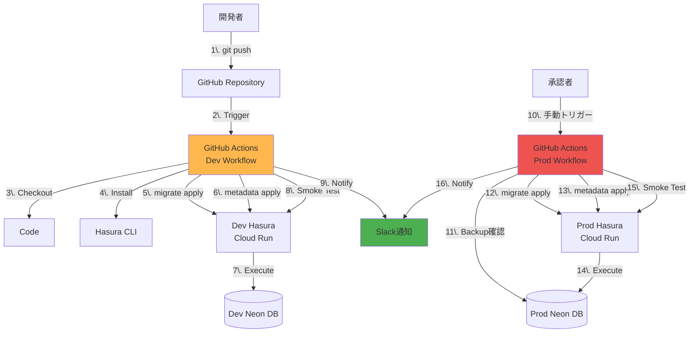
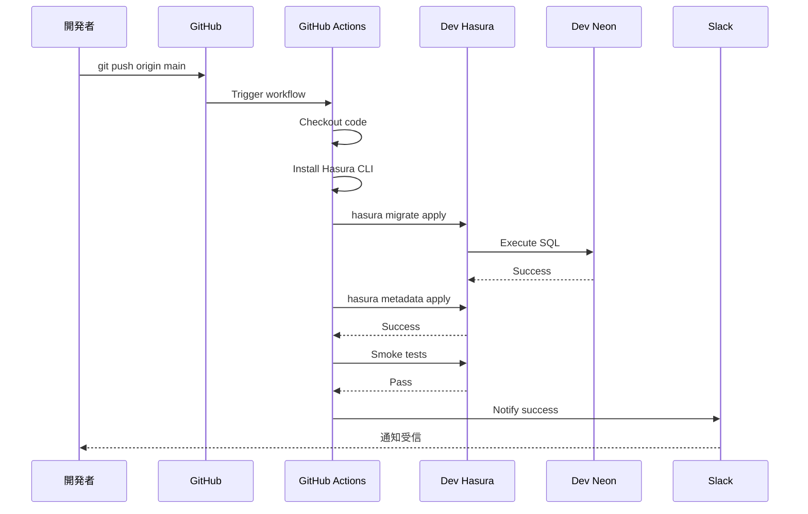
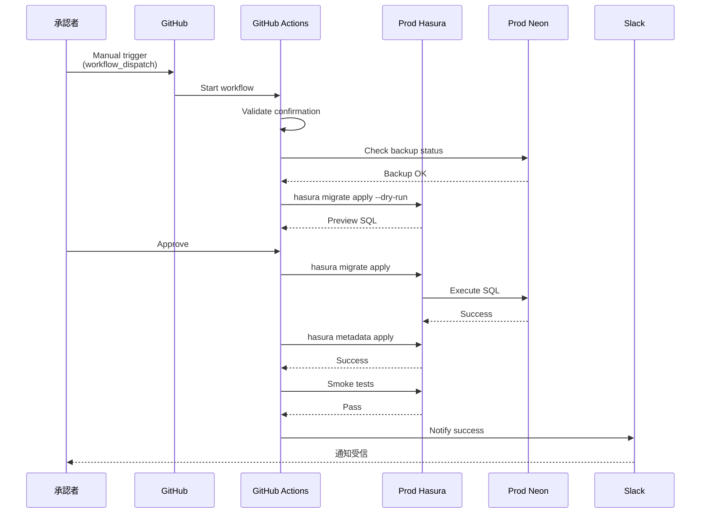

# デプロイフロー

このドキュメントでは、CI/CDパイプラインとdev/prod環境へのデプロイ手順を説明します。

## デプロイフロー全体図



---

## Dev 環境への自動デプロイ

### トリガー条件

- `main` ブランチへの push
- `backend/hasura/migrations/**` または `backend/hasura/metadata/**` の変更

### ワークフロー定義

`.github/workflows/deploy-dev.yml`:

```yaml
name: Deploy to Dev

on:
  push:
    branches:
      - main
    paths:
      - 'backend/hasura/migrations/**'
      - 'backend/hasura/metadata/**'
      - '.github/workflows/deploy-dev.yml'

jobs:
  deploy-migrations:
    runs-on: ubuntu-latest
    environment: dev

    steps:
      - name: Checkout code
        uses: actions/checkout@v4

      - name: Install Hasura CLI
        run: |
          curl -L https://github.com/hasura/graphql-engine/raw/stable/cli/get.sh | bash
          hasura version

      - name: Apply Migrations
        env:
          HASURA_GRAPHQL_ENDPOINT: ${{ secrets.DEV_HASURA_ENDPOINT }}
          HASURA_GRAPHQL_ADMIN_SECRET: ${{ secrets.DEV_HASURA_ADMIN_SECRET }}
        run: |
          cd backend/hasura
          hasura migrate apply --endpoint "$HASURA_GRAPHQL_ENDPOINT" --admin-secret "$HASURA_GRAPHQL_ADMIN_SECRET"

      - name: Apply Metadata
        env:
          HASURA_GRAPHQL_ENDPOINT: ${{ secrets.DEV_HASURA_ENDPOINT }}
          HASURA_GRAPHQL_ADMIN_SECRET: ${{ secrets.DEV_HASURA_ADMIN_SECRET }}
        run: |
          cd backend/hasura
          hasura metadata apply --endpoint "$HASURA_GRAPHQL_ENDPOINT" --admin-secret "$HASURA_GRAPHQL_ADMIN_SECRET"

      - name: Reload Metadata
        env:
          HASURA_GRAPHQL_ENDPOINT: ${{ secrets.DEV_HASURA_ENDPOINT }}
          HASURA_GRAPHQL_ADMIN_SECRET: ${{ secrets.DEV_HASURA_ADMIN_SECRET }}
        run: |
          cd backend/hasura
          hasura metadata reload --endpoint "$HASURA_GRAPHQL_ENDPOINT" --admin-secret "$HASURA_GRAPHQL_ADMIN_SECRET"

      - name: Run Smoke Tests
        env:
          HASURA_GRAPHQL_ENDPOINT: ${{ secrets.DEV_HASURA_ENDPOINT }}
          HASURA_GRAPHQL_ADMIN_SECRET: ${{ secrets.DEV_HASURA_ADMIN_SECRET }}
        run: |
          bash backend/scripts/smoke-test.sh

      - name: Notify Slack
        if: always()
        uses: slackapi/slack-github-action@v1
        with:
          webhook-url: ${{ secrets.SLACK_WEBHOOK_URL }}
          payload: |
            {
              "text": "Dev Deployment ${{ job.status }}",
              "blocks": [
                {
                  "type": "section",
                  "text": {
                    "type": "mrkdwn",
                    "text": "*Dev Deployment Status:* ${{ job.status }}\n*Commit:* <${{ github.event.head_commit.url }}|${{ github.event.head_commit.message }}>"
                  }
                }
              ]
            }
```

---

## Prod 環境への手動デプロイ

### トリガー条件

- 手動トリガー（`workflow_dispatch`）
- 承認者のみ実行可能

### ワークフロー定義

`.github/workflows/deploy-prod.yml`:

```yaml
name: Deploy to Prod

on:
  workflow_dispatch:
    inputs:
      confirm:
        description: 'Type "DEPLOY" to confirm'
        required: true
        default: ''

jobs:
  pre-check:
    runs-on: ubuntu-latest
    steps:
      - name: Validate Confirmation
        if: github.event.inputs.confirm != 'DEPLOY'
        run: |
          echo "Deployment cancelled. You must type 'DEPLOY' to confirm."
          exit 1

  deploy-migrations:
    needs: pre-check
    runs-on: ubuntu-latest
    environment:
      name: production
      url: https://hasura.example.com

    steps:
      - name: Checkout code
        uses: actions/checkout@v4

      - name: Install Hasura CLI
        run: |
          curl -L https://github.com/hasura/graphql-engine/raw/stable/cli/get.sh | bash
          hasura version

      - name: Check Backup Status
        run: |
          echo "Verifying Neon backup exists..."
          # Neon API で最新バックアップを確認（スクリプト例）
          # curl -H "Authorization: Bearer $NEON_API_KEY" \
          #   https://console.neon.tech/api/v2/projects/$PROJECT_ID/branches/main/backups

      - name: Dry Run Migrations
        env:
          HASURA_GRAPHQL_ENDPOINT: ${{ secrets.PROD_HASURA_ENDPOINT }}
          HASURA_GRAPHQL_ADMIN_SECRET: ${{ secrets.PROD_HASURA_ADMIN_SECRET }}
        run: |
          cd backend/hasura
          hasura migrate apply --dry-run --endpoint "$HASURA_GRAPHQL_ENDPOINT" --admin-secret "$HASURA_GRAPHQL_ADMIN_SECRET"

      - name: Apply Migrations
        env:
          HASURA_GRAPHQL_ENDPOINT: ${{ secrets.PROD_HASURA_ENDPOINT }}
          HASURA_GRAPHQL_ADMIN_SECRET: ${{ secrets.PROD_HASURA_ADMIN_SECRET }}
        run: |
          cd backend/hasura
          hasura migrate apply --endpoint "$HASURA_GRAPHQL_ENDPOINT" --admin-secret "$HASURA_GRAPHQL_ADMIN_SECRET"

      - name: Apply Metadata
        env:
          HASURA_GRAPHQL_ENDPOINT: ${{ secrets.PROD_HASURA_ENDPOINT }}
          HASURA_GRAPHQL_ADMIN_SECRET: ${{ secrets.PROD_HASURA_ADMIN_SECRET }}
        run: |
          cd backend/hasura
          hasura metadata apply --endpoint "$HASURA_GRAPHQL_ENDPOINT" --admin-secret "$HASURA_GRAPHQL_ADMIN_SECRET"

      - name: Reload Metadata
        env:
          HASURA_GRAPHQL_ENDPOINT: ${{ secrets.PROD_HASURA_ENDPOINT }}
          HASURA_GRAPHQL_ADMIN_SECRET: ${{ secrets.PROD_HASURA_ADMIN_SECRET }}
        run: |
          cd backend/hasura
          hasura metadata reload --endpoint "$HASURA_GRAPHQL_ENDPOINT" --admin-secret "$HASURA_GRAPHQL_ADMIN_SECRET"

      - name: Run Smoke Tests
        env:
          HASURA_GRAPHQL_ENDPOINT: ${{ secrets.PROD_HASURA_ENDPOINT }}
          HASURA_GRAPHQL_ADMIN_SECRET: ${{ secrets.PROD_HASURA_ADMIN_SECRET }}
        run: |
          bash backend/scripts/smoke-test.sh

      - name: Notify Slack
        if: always()
        uses: slackapi/slack-github-action@v1
        with:
          webhook-url: ${{ secrets.SLACK_WEBHOOK_URL }}
          payload: |
            {
              "text": "🚀 Prod Deployment ${{ job.status }}",
              "blocks": [
                {
                  "type": "section",
                  "text": {
                    "type": "mrkdwn",
                    "text": "*Production Deployment Status:* ${{ job.status }}\n*Triggered by:* ${{ github.actor }}\n*Commit:* <${{ github.event.head_commit.url }}|${{ github.sha }}>"
                  }
                }
              ]
            }
```

---

## スモークテスト

### テスト内容

`backend/scripts/smoke-test.sh`:

```bash
#!/bin/bash
set -e

ENDPOINT="${HASURA_GRAPHQL_ENDPOINT}"
ADMIN_SECRET="${HASURA_GRAPHQL_ADMIN_SECRET}"

echo "Running smoke tests against: $ENDPOINT"

# 1. Health Check
echo "1. Health Check..."
curl -f "${ENDPOINT}/healthz" || {
  echo "❌ Health check failed"
  exit 1
}
echo "✅ Health check passed"

# 2. GraphQL Introspection
echo "2. GraphQL Introspection..."
QUERY='{"query": "{ __schema { queryType { name } } }"}'
RESPONSE=$(curl -s -X POST "$ENDPOINT/v1/graphql" \
  -H "Content-Type: application/json" \
  -H "x-hasura-admin-secret: $ADMIN_SECRET" \
  -d "$QUERY")

if echo "$RESPONSE" | grep -q "query_root"; then
  echo "✅ GraphQL introspection passed"
else
  echo "❌ GraphQL introspection failed"
  echo "$RESPONSE"
  exit 1
fi

# 3. Anonymous Role Query (should fail or return limited data)
echo "3. Anonymous role test..."
QUERY='{"query": "{ users { id } }"}'
RESPONSE=$(curl -s -X POST "$ENDPOINT/v1/graphql" \
  -H "Content-Type: application/json" \
  -d "$QUERY")

# Anonymousは users にアクセスできないはず
if echo "$RESPONSE" | grep -q "error"; then
  echo "✅ Anonymous role correctly restricted"
else
  echo "⚠️ Anonymous role might have too much access"
fi

# 4. Admin Role Query
echo "4. Admin role test..."
QUERY='{"query": "{ users { id } }"}'
RESPONSE=$(curl -s -X POST "$ENDPOINT/v1/graphql" \
  -H "Content-Type: application/json" \
  -H "x-hasura-admin-secret: $ADMIN_SECRET" \
  -d "$QUERY")

if echo "$RESPONSE" | grep -q "users"; then
  echo "✅ Admin role query passed"
else
  echo "❌ Admin role query failed"
  echo "$RESPONSE"
  exit 1
fi

echo ""
echo "🎉 All smoke tests passed!"
```

実行権限付与:
```bash
chmod +x backend/scripts/smoke-test.sh
```

---

## Hasura Cloud Run デプロイ

### Dockerfile

`backend/Dockerfile`:

```dockerfile
FROM hasura/graphql-engine:v2.36.0

# 環境変数はCloud Runで設定
ENV HASURA_GRAPHQL_ENABLE_CONSOLE=false
ENV HASURA_GRAPHQL_DEV_MODE=false
ENV HASURA_GRAPHQL_ENABLED_LOG_TYPES="startup, http-log, webhook-log, websocket-log, query-log"

EXPOSE 8080
```

### Cloud Run デプロイコマンド

```bash
# Dev環境
gcloud run deploy hasura-dev \
  --image hasura/graphql-engine:v2.36.0 \
  --platform managed \
  --region us-central1 \
  --allow-unauthenticated \
  --set-env-vars "HASURA_GRAPHQL_DATABASE_URL=$DEV_DATABASE_URL" \
  --set-secrets "HASURA_GRAPHQL_ADMIN_SECRET=hasura-admin-secret-dev:latest" \
  --set-secrets "HASURA_GRAPHQL_JWT_SECRET=hasura-jwt-secret-dev:latest" \
  --min-instances 1 \
  --max-instances 10 \
  --memory 512Mi \
  --cpu 1

# Prod環境
gcloud run deploy hasura-prod \
  --image hasura/graphql-engine:v2.36.0 \
  --platform managed \
  --region us-central1 \
  --allow-unauthenticated \
  --set-env-vars "HASURA_GRAPHQL_DATABASE_URL=$PROD_DATABASE_URL" \
  --set-secrets "HASURA_GRAPHQL_ADMIN_SECRET=hasura-admin-secret-prod:latest" \
  --set-secrets "HASURA_GRAPHQL_JWT_SECRET=hasura-jwt-secret-prod:latest" \
  --set-env-vars "HASURA_GRAPHQL_ENABLE_CONSOLE=false" \
  --min-instances 1 \
  --max-instances 50 \
  --memory 1Gi \
  --cpu 2
```

---

## Secret Manager 設定

### 必要なSecrets

| Secret名 | 説明 | 例 |
|---------|------|-----|
| `DEV_HASURA_ENDPOINT` | Dev Hasura URL | `https://hasura-dev-xxx.run.app` |
| `DEV_HASURA_ADMIN_SECRET` | Dev Admin Secret | `random-secret-dev-123` |
| `PROD_HASURA_ENDPOINT` | Prod Hasura URL | `https://hasura-prod-xxx.run.app` |
| `PROD_HASURA_ADMIN_SECRET` | Prod Admin Secret | `random-secret-prod-456` |
| `SLACK_WEBHOOK_URL` | Slack通知用 | `https://hooks.slack.com/...` |

### GitHub Secrets 設定

1. GitHub リポジトリ → Settings → Secrets and variables → Actions
2. "New repository secret" をクリック
3. 各 Secret を追加

### Secret Manager（GCP）設定

```bash
# Admin Secret作成
echo -n "your-super-secret-key" | gcloud secrets create hasura-admin-secret-dev --data-file=-

# JWT Secret作成
cat > jwt-secret-dev.json <<EOF
{
  "type": "RS256",
  "jwk_url": "https://www.googleapis.com/service_accounts/v1/jwk/securetoken@system.gserviceaccount.com",
  "issuer": "https://securetoken.google.com/myproject-dev",
  "audience": "myproject-dev"
}
EOF

gcloud secrets create hasura-jwt-secret-dev --data-file=jwt-secret-dev.json
```

---

## ロールバック手順

### ケース1: マイグレーションのロールバック

```bash
# 最新のマイグレーションを1つロールバック
cd backend/hasura
hasura migrate apply --down 1 --endpoint $PROD_HASURA_ENDPOINT --admin-secret $ADMIN_SECRET

# 特定のバージョンまでロールバック
hasura migrate apply --goto <version> --endpoint $PROD_HASURA_ENDPOINT --admin-secret $ADMIN_SECRET
```

**注意**: `down.sql` が正しく定義されている必要があります。

### ケース2: Neon Snapshotからのリストア

```bash
# Neon Web Console または CLI でスナップショットを選択
# → Restore を実行

# または Neon CLI（例）
neon branch restore main --snapshot <snapshot-id>
```

### ケース3: メタデータのロールバック

```bash
# Git履歴から以前のメタデータを取得
git checkout <commit-hash> -- backend/hasura/metadata/

# 適用
hasura metadata apply --endpoint $PROD_HASURA_ENDPOINT --admin-secret $ADMIN_SECRET
```

---

## GitHub Environments 設定

### Dev Environment

1. GitHub リポジトリ → Settings → Environments
2. "New environment" → `dev`
3. Protection rules:
   - Required reviewers: なし（自動デプロイ）
   - Wait timer: 0分

### Production Environment

1. "New environment" → `production`
2. Protection rules:
   - ✅ Required reviewers: 承認者を指定（例: Tech Lead）
   - Wait timer: 0分
3. Environment secrets:
   - `PROD_HASURA_ENDPOINT`
   - `PROD_HASURA_ADMIN_SECRET`

---

## デプロイフロー（シーケンス図）

### Dev 自動デプロイ



### Prod 手動デプロイ



---

## モニタリング・アラート

### Cloud Run ログ

```bash
# Dev環境のログ確認
gcloud logging read "resource.type=cloud_run_revision AND resource.labels.service_name=hasura-dev" --limit 50

# エラーログのみ
gcloud logging read "resource.type=cloud_run_revision AND resource.labels.service_name=hasura-dev AND severity>=ERROR" --limit 50
```

### Hasura ログ設定

環境変数:
```bash
HASURA_GRAPHQL_ENABLED_LOG_TYPES="startup, http-log, webhook-log, websocket-log, query-log"
HASURA_GRAPHQL_LOG_LEVEL="info"  # debug | info | warn | error
```

### アラート設定（Cloud Monitoring）

- エラー率が5%を超えた場合
- レスポンスタイムが1秒を超えた場合
- マイグレーション失敗時

---

## まとめ

**Dev デプロイ**:
- `main` ブランチへの push で自動実行
- スモークテスト実施
- Slack 通知

**Prod デプロイ**:
- 手動トリガー + 承認必須
- バックアップ確認
- Dry-run で事前確認
- ロールバック手順を用意

**ベストプラクティス**:
- マイグレーションは小さく分割
- `down.sql` を必ず実装
- デプロイ前にバックアップ確認
- スモークテストで最低限の動作を保証

次は [トラブルシューティング](troubleshooting.md) でよくある問題の解決方法を確認してください。
