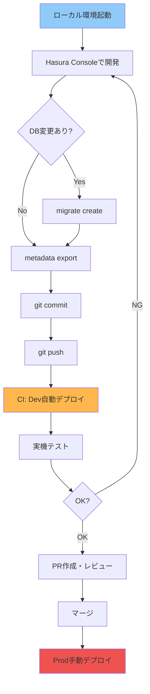
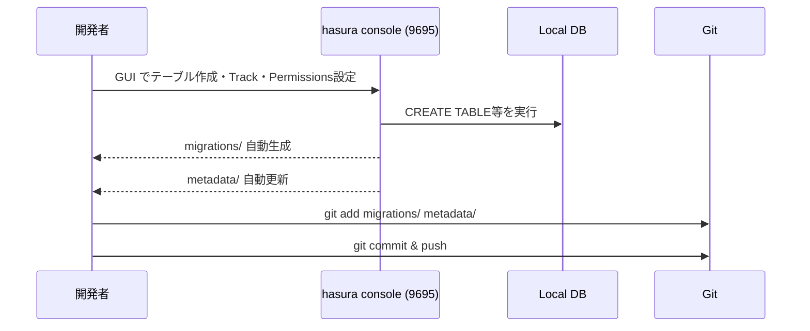
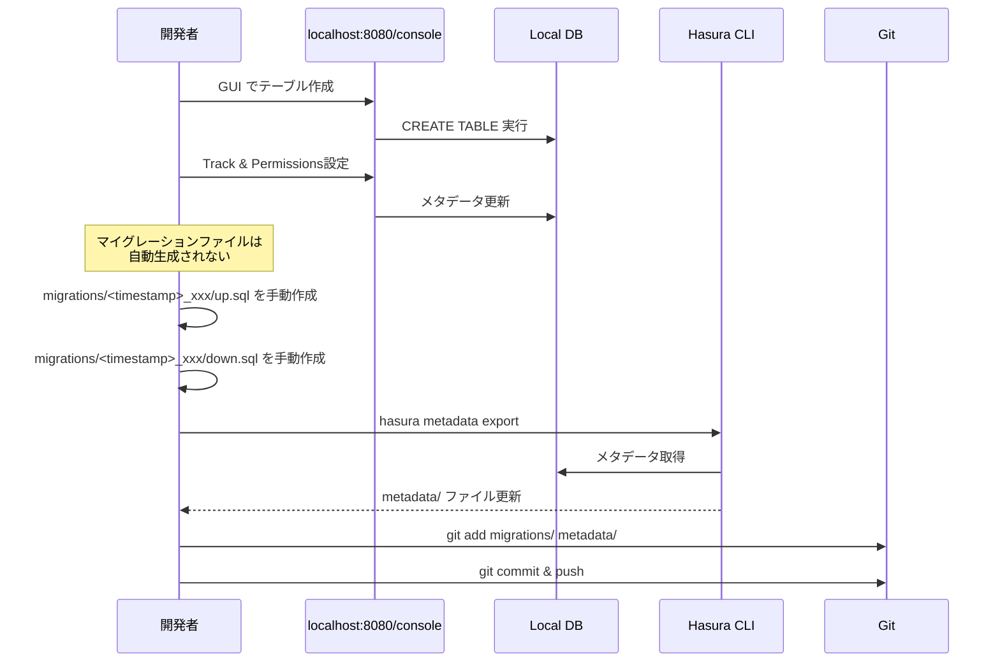

# 開発フロー

このドキュメントでは、ローカル開発からマイグレーション作成、PR作成までの具体的な手順を説明します。

## 開発サイクル全体図



---

## ローカル開発環境のセットアップ

### 1. 初回セットアップ

```bash
# リポジトリクローン
git clone <repository-url>
cd hasura_flutter

# バックエンド環境変数設定
cd backend
cp .env.example .env
# .env を編集（POSTGRES_PASSWORD等）

# Hasura CLI設定
cd hasura
cp config.yaml.example config.yaml
# config.yaml を編集

# Docker起動
cd ..
docker compose up -d

# マイグレーション適用（既存のマイグレーションがある場合）
cd hasura
hasura migrate apply
hasura metadata apply
hasura seed apply  # テストデータ投入
```

### 2. 日常的な起動

```bash
cd backend
docker compose up -d

cd hasura
hasura console
```

ブラウザで自動的に開く:
- Hasura Console: `http://localhost:9695`
- GraphQL Endpoint: `http://localhost:8080/v1/graphql`

---

## ⚠️ Hasura Console の2種類と使い分け

Hasuraには**2つの異なるConsole**があります。混同しやすいので注意してください。

### 🔴 方法1: Hasura サーバー本体のConsole（`localhost:8080`）

**アクセス**: `http://localhost:8080/console`
**ログイン**: `admin_secret` を入力

**特徴**:
- Hasuraサーバーが直接提供するWeb UI
- すぐにアクセスできる（`hasura console` コマンド不要）

**⚠️ 重大な問題**:
- この画面で変更しても、**マイグレーションファイルが生成されない**
- つまり、変更がGitで管理できない
- チーム開発では使わない（確認用のみ）

**使用ケース**:
- ✅ データの確認（SELECT）
- ✅ GraphQLクエリのテスト
- ✅ パーミッションの動作確認
- ❌ スキーマ変更（テーブル作成・カラム追加等）

---

### 🟢 方法2: Hasura CLI経由のConsole（`localhost:9695`）- **理想だが注意**

**起動方法**: `hasura console` コマンド
**アクセス**: `http://localhost:9695`
**ログイン**: 通常は不要（Collaborator Tokenエラーが出た場合は後述）

**特徴**:
- Hasura CLIが仲介して起動
- この画面で変更すると、**自動的にマイグレーションファイルが生成される**
- Gitで管理できる

**⚠️ 既知の問題（CORS エラー）**:
環境によっては、CLI Console が CORS エラーで正常に動作しないことがあります。その場合は以下の回避策を使用してください：

**回避策**: 方法1（サーバーConsole）+ 手動メタデータエクスポート
1. `http://localhost:8080/console` でTrack・Permissions設定
2. マイグレーションは手動作成（後述）
3. `hasura metadata export` で手動エクスポート

この方法でも問題なく開発できます。

---

### 使い分けまとめ

| 作業内容 | `localhost:8080` | `localhost:9695`（CLI） |
|---------|-----------------|----------------------|
| テーブル作成・変更 | ⚠️ 手動マイグレーション必要 | ✅ 自動生成（理想） |
| パーミッション設定 | ⚠️ metadata export必要 | ✅ 自動保存（理想） |
| Track（テーブル追跡） | ⚠️ metadata export必要 | ✅ 自動保存（理想） |
| データ確認 | ✅ | ✅ |
| GraphQLテスト | ✅ | ✅ |

**原則（理想）**: スキーマやパーミッションを変更する時は、**`hasura console` (CLI経由)** を使う。

**実際の運用**: CLI Console が CORS エラーで動かない場合：
1. `localhost:8080/console` でGUI操作
2. 手動でマイグレーション作成 & メタデータエクスポート
3. この方法でも問題なく開発できる

---

## テーブルの「Track（追跡）」とは？

### Trackの必要性

PostgreSQLにテーブルを作成しただけでは、**HasuraはそのテーブルをGraphQL APIとして公開しません**。

```
PostgreSQL     →    Track    →    GraphQL API
テーブル作成           設定          利用可能
```

### Trackしないとどうなるか

**PostgreSQL側**:
```sql
-- テーブルは存在する
SELECT * FROM posts;  -- ✅ OK
```

**GraphQL側**:
```graphql
query {
  posts {  # ❌ エラー: "posts" field not found
    id
    title
  }
}
```

### Trackするとどうなるか

Hasuraが自動的に以下を生成：
- Query: `posts`, `posts_by_pk`, `posts_aggregate`
- Mutation: `insert_posts`, `update_posts`, `delete_posts`
- Subscription: `posts` (リアルタイム)

```graphql
query {
  posts {  # ✅ OK！
    id
    title
    user {  # リレーションも使える
      name
    }
  }
}
```

---

### Trackの実行方法

#### 方法1: Hasura Console（GUI）で Track

1. `http://localhost:9695` → Data タブ
2. "Untracked tables" セクション
3. テーブル横の「Track」ボタンをクリック

**自動で行われること**:
- メタデータに記録
- GraphQLスキーマ生成
- `hasura metadata export` で自動保存

#### 方法2: コマンドで Track

```bash
# 全てのテーブルを一括Track
hasura metadata reload

# または、メタデータを手動編集してapply
hasura metadata apply
```

---

### チーム開発での Track

**重要**: 個別に Track 作業は不要！

新規参加者がリポジトリをcloneした場合：

```bash
# 1. マイグレーション適用（テーブル作成）
hasura migrate apply

# 2. メタデータ適用（Track情報も含む）
hasura metadata apply
```

`hasura metadata apply` で、Track情報も全て反映されます。

---

### いつ Track が必要か

| 状況 | Track必要？ | 理由 |
|------|-----------|------|
| Hasura Console（GUI）でテーブル作成 | 自動 | Consoleが自動でTrack |
| マイグレーションファイルでテーブル作成 | 手動 | 後で `metadata export` が必要 |
| 他の開発者が作ったテーブルをpull | 不要 | `metadata apply` で自動 |
| テーブルのカラム追加・変更 | 不要 | 既にTrack済み |

---

### Track の実体

Trackされた情報は `metadata/databases/default/tables/` に保存されます：

```yaml
# metadata/databases/default/tables/public_posts.yaml
table:
  name: posts
  schema: public
object_relationships:
  - name: user
    using:
      foreign_key_constraint_on: user_id
array_relationships:
  - name: comments
    using:
      foreign_key_constraint_on:
        column: post_id
        table:
          name: comments
          schema: public
```

このファイルをGitで管理することで、チーム全体で同じGraphQL APIを共有できます。

---

## DB変更の作成フロー

### 実際の開発ワークフロー（2つのアプローチ）

#### アプローチA: CLI Console（理想・自動）



#### アプローチB: サーバーConsole（CORS問題時の回避策・手動）



**このプロジェクトでは、CLI Console が CORS エラーで動作しなかったため、アプローチB を採用しています。**

---

### ケース1: テーブル作成（手動マイグレーション方式）

**実際の手順（手動マイグレーション方式）**:

1. **Hasura Console でテーブル作成**:
   - `http://localhost:8080/console` → Data タブ（admin_secretでログイン）
   - "Create Table" をクリック
   - テーブル名: `posts`
   - カラム追加:
     - `id` UUID, Primary Key, Default: `gen_random_uuid()`
     - `tenant_id` UUID, Not Null
     - `title` Text, Not Null
     - `content` Text, Not Null
     - `created_at` Timestamp with timezone, Default: `now()`
   - "Add Table" クリック

2. **外部キー追加**:
   - "Modify" タブ → "Foreign Keys"
   - `tenant_id` → `organizations(id)`, ON DELETE CASCADE

3. **インデックス追加**:
   - SQL タブで実行:
   ```sql
   CREATE INDEX idx_posts_tenant_id ON posts(tenant_id);
   CREATE INDEX idx_posts_created_at ON posts(created_at DESC);
   ```

4. **Track & Relationships**:
   - "Track" ボタンをクリック（Untrackedの場合）
   - "Relationships" タブで foreign key relationships を Track

5. **パーミッション設定**:
   - "Permissions" タブ
   - `user` / `tenant_admin` / `admin` ロールで権限を設定

6. **マイグレーションファイルを手動作成**:
   ```bash
   cd backend/hasura/migrations/default
   mkdir 1234567890123_create_posts_table  # タイムスタンプは現在時刻のUNIX時間（ミリ秒）
   cd 1234567890123_create_posts_table
   ```

   `up.sql` を作成:
   ```sql
   CREATE TABLE posts (
     id UUID PRIMARY KEY DEFAULT gen_random_uuid(),
     tenant_id UUID NOT NULL REFERENCES organizations(id) ON DELETE CASCADE,
     title TEXT NOT NULL,
     content TEXT NOT NULL,
     created_at TIMESTAMPTZ NOT NULL DEFAULT NOW(),
     updated_at TIMESTAMPTZ NOT NULL DEFAULT NOW()
   );

   CREATE INDEX idx_posts_tenant_id ON posts(tenant_id);
   CREATE INDEX idx_posts_created_at ON posts(created_at DESC);

   CREATE TRIGGER update_posts_updated_at
     BEFORE UPDATE ON posts
     FOR EACH ROW
     EXECUTE FUNCTION update_updated_at_column();
   ```

   `down.sql` を作成:
   ```sql
   DROP TRIGGER IF EXISTS update_posts_updated_at ON posts;
   DROP TABLE IF EXISTS posts CASCADE;
   ```

7. **メタデータエクスポート**:
   ```bash
   cd backend/hasura
   hasura metadata export
   ```

   更新されるファイル:
   ```
   metadata/
   ├── databases/
   │   └── default/
   │       └── tables/
   │           ├── public_posts.yaml  # Track & Permissions情報
   │           └── ...
   └── ...
   ```

8. **Git コミット**:
   ```bash
   git add migrations/ metadata/
   git commit -m "Add posts table with tenant support and permissions"
   git push origin main
   ```

---

### ケース2: カラム追加

1. **Hasura Console で追加**:
   - Data → `posts` テーブル → Modify
   - "Add a new column" で `slug` Text を追加

2. **マイグレーション生成**:
   ```bash
   hasura migrate create "add_slug_to_posts" --from-server
   ```

3. **メタデータエクスポート**:
   ```bash
   hasura metadata export
   ```

4. **Git コミット**:
   ```bash
   git add migrations/ metadata/
   git commit -m "Add slug column to posts table"
   git push
   ```

---

### ケース3: パーミッション変更のみ

パーミッション変更はメタデータのみの変更なので、マイグレーション不要:

1. **Hasura Console でパーミッション変更**:
   - Permissions タブで調整

2. **メタデータエクスポート**:
   ```bash
   hasura metadata export
   ```

3. **Git コミット**:
   ```bash
   git add metadata/
   git commit -m "Update user role permissions for posts"
   git push
   ```

---

## マイグレーションのベストプラクティス

### 1. 1つのマイグレーション = 1つの変更

❌ **悪い例**:
```bash
# 複数の変更を1つのマイグレーションに
hasura migrate create "add_multiple_tables"
```

✅ **良い例**:
```bash
hasura migrate create "create_posts_table"
hasura migrate create "create_comments_table"
hasura migrate create "add_index_posts_tenant"
```

### 2. `up.sql` と `down.sql` を必ず確認

生成された SQL を確認し、必要に応じて手動調整:

**up.sql**:
```sql
CREATE TABLE posts (
  id UUID PRIMARY KEY DEFAULT uuid_generate_v7(),
  tenant_id UUID NOT NULL REFERENCES organizations(id) ON DELETE CASCADE,
  title TEXT NOT NULL,
  content TEXT NOT NULL,
  created_at TIMESTAMPTZ NOT NULL DEFAULT NOW(),
  updated_at TIMESTAMPTZ NOT NULL DEFAULT NOW()
);

CREATE INDEX idx_posts_tenant_id ON posts(tenant_id);
CREATE INDEX idx_posts_created_at ON posts(created_at DESC);

-- トリガー追加
CREATE TRIGGER update_posts_updated_at
  BEFORE UPDATE ON posts
  FOR EACH ROW
  EXECUTE FUNCTION update_updated_at_column();
```

**down.sql**:
```sql
DROP TRIGGER IF EXISTS update_posts_updated_at ON posts;
DROP TABLE IF EXISTS posts CASCADE;
```

### 3. マイグレーション実行前に dry-run

```bash
# ローカルで確認
hasura migrate apply --dry-run

# 問題なければ適用
hasura migrate apply
```

### 4. メタデータとマイグレーションを分けて管理

- **マイグレーション**: DB構造の変更（テーブル、カラム、インデックス）
- **メタデータ**: Hasuraの設定（パーミッション、リレーション、Computed Fields）

---

## Flutter アプリ開発との連携

### GraphQL スキーマの自動生成

1. **`.graphql` ファイルを作成**:

`app/graphql/posts.graphql`:
```graphql
query GetPosts($tenantId: uuid!) {
  posts(
    where: {
      tenant_id: { _eq: $tenantId }
      deleted_at: { _is_null: true }
    }
    order_by: { created_at: desc }
  ) {
    id
    title
    content
    created_at
    user {
      id
      name
    }
  }
}

mutation CreatePost($tenantId: uuid!, $title: String!, $content: String!) {
  insert_posts_one(
    object: {
      tenant_id: $tenantId
      title: $title
      content: $content
      status: "draft"
    }
  ) {
    id
    title
  }
}
```

2. **コード生成**:

```bash
cd app
flutter pub run build_runner build --delete-conflicting-outputs
```

生成されるファイル:
```
app/lib/generated/
├── posts.graphql.dart
└── ...
```

3. **Flutter で使用**:

```dart
import 'package:app/generated/posts.graphql.dart';

// クエリ実行
final result = await client.query$GetPosts(
  Options$Query$GetPosts(
    variables: Variables$Query$GetPosts(
      tenantId: currentTenantId,
    ),
  ),
);

if (result.hasException) {
  // エラーハンドリング
}

final posts = result.parsedData?.posts ?? [];
```

---

## ローカル環境のリセット

### 完全リセット（DBを空に）

```bash
cd backend

# コンテナとボリュームを削除
docker compose down -v

# 再起動
docker compose up -d

# マイグレーション再適用
cd hasura
hasura migrate apply
hasura metadata apply
hasura seed apply
```

### マイグレーションのみリセット

```bash
# 全マイグレーションをロールバック
hasura migrate apply --down all

# 再適用
hasura migrate apply
```

---

## トラブルシューティング

### マイグレーション生成時のエラー

**問題**: `hasura migrate create` が失敗する

**原因**: Hasura Console を CLI 経由で起動していない

**解決**:
```bash
# ❌ 直接 http://localhost:8080/console にアクセス
# ✅ CLI 経由で起動
hasura console
```

### メタデータの競合

**問題**: `git pull` 後にメタデータが競合

**解決**:
```bash
# リモートのメタデータを優先
git checkout --theirs metadata/
hasura metadata apply

# ローカルのメタデータを優先
git checkout --ours metadata/
hasura metadata export
```

### Docker が起動しない

**問題**: `docker compose up` が失敗

**確認事項**:
1. Docker Desktop が起動しているか
2. ポート競合（5432, 8080, 5050）
   ```bash
   lsof -i :5432
   lsof -i :8080
   ```
3. `.env` ファイルが存在するか

---

## チーム開発時の注意点

### 1. マイグレーションの順序

マイグレーションはタイムスタンプ順に実行されます。

複数人が同時にマイグレーションを作成すると、タイムスタンプが前後する可能性があります。

**ベストプラクティス**:
- `git pull` してから新しいマイグレーション作成
- PR は小さく、頻繁にマージ

### 2. メタデータの衝突

パーミッション設定等のメタデータは YAML ファイルで管理されます。

**衝突を避ける方法**:
- 異なるテーブルを担当する
- PR をレビュー・マージしてから次の作業開始

### 3. Dev 環境の共有

Dev 環境はチーム全体で共有されます。

**注意事項**:
- テストデータの削除は慎重に
- 破壊的なマイグレーションは事前に通知
- ロールバックが必要な場合は Slack 等で共有

---

## CI/CD との連携

### GitHub Actions ワークフロー（簡易版）

`.github/workflows/deploy-dev.yml`:
```yaml
name: Deploy to Dev

on:
  push:
    branches:
      - main

jobs:
  deploy:
    runs-on: ubuntu-latest
    steps:
      - uses: actions/checkout@v3

      - name: Install Hasura CLI
        run: |
          curl -L https://github.com/hasura/graphql-engine/raw/stable/cli/get.sh | bash

      - name: Apply Migrations
        env:
          HASURA_GRAPHQL_ENDPOINT: ${{ secrets.DEV_HASURA_ENDPOINT }}
          HASURA_GRAPHQL_ADMIN_SECRET: ${{ secrets.DEV_HASURA_ADMIN_SECRET }}
        run: |
          cd backend/hasura
          hasura migrate apply --endpoint $HASURA_GRAPHQL_ENDPOINT
          hasura metadata apply --endpoint $HASURA_GRAPHQL_ENDPOINT

      - name: Smoke Test
        run: |
          bash backend/scripts/smoke-test.sh
```

詳細は [デプロイフロー](deployment.md) を参照。

---

## まとめ

**ローカル開発フロー**:
1. Hasura Console で開発（DB変更・パーミッション設定）
2. `hasura migrate create --from-server <name>` でマイグレーション生成
3. `hasura metadata export` でメタデータ保存
4. Git コミット・プッシュ
5. CI で Dev 環境に自動デプロイ
6. 実機テスト → OK なら PR 作成
7. レビュー・マージ → Prod デプロイ

**ポイント**:
- Hasura Console は必ず CLI 経由で起動
- マイグレーションは小さく分割
- `up.sql` / `down.sql` を必ず確認
- メタデータとマイグレーションをセットでコミット

次は [デプロイフロー](deployment.md) で CI/CD の詳細を確認してください。
