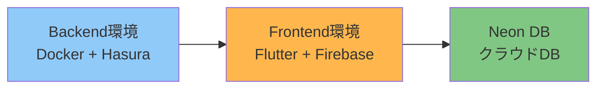

# セットアップガイド

hasura_flutter プロジェクトの開発環境をゼロから構築するための総合ガイドです。

## 📋 セットアップの全体像

このプロジェクトでは、以下の3つの環境を構築します:

### 推奨セットアップ順序

1. **Backend環境** (30分) - ローカルでDB開発するための基盤
2. **Frontend環境** (45分) - Flutter アプリ開発環境
3. **Neon DB** (15分) - クラウド環境へのデプロイ準備

**合計所要時間**: 約1.5〜2時間

---

## Step 1: Backend環境構築

**目的**: ローカルでHasura開発を行うための環境

**構成**:
- Docker Compose（PostgreSQL + Hasura）
- Hasura CLI
- pgAdmin（オプション）

**👉 [backend-setup.md に進む](backend-setup.md)**

### 完了チェックリスト

- [ ] Docker Desktop インストール済み
- [ ] Hasura CLI インストール済み（`hasura version`）
- [ ] `docker compose up -d` でサービス起動成功
- [ ] `http://localhost:8080/console` にアクセス可能
- [ ] マイグレーション適用済み
- [ ] シードデータ投入済み

---

## Step 2: Frontend環境構築

**目的**: Flutter アプリを開発・実機テストするための環境

**構成**:
- Flutter SDK (fvm管理)
- Firebase プロジェクト (dev/prod)
- VS Code / Cursor デバッグ設定

**👉 [frontend-setup.md に進む](frontend-setup.md)**

### 完了チェックリスト

- [ ] Flutter SDK インストール済み（fvm）
- [ ] Firebase プロジェクト作成済み（dev/prod）
- [ ] Firebase設定ファイル配置済み（google-services.json等）
- [ ] Flavor設定完了（Android/iOS）
- [ ] `flutter run --flavor dev` でアプリ起動成功
- [ ] VS Code / Cursor デバッグ実行可能

---

## Step 3: Neon DB 初期セットアップ

**目的**: クラウド環境（dev/prod）のデータベースを準備

**構成**:
- Neon プロジェクト作成
- development / production ブランチ
- ローカルマイグレーションの適用

**👉 [neon-setup.md に進む](neon-setup.md)**

### 完了チェックリスト

- [ ] Neon アカウント作成済み
- [ ] Neon プロジェクト作成済み（`hasura-flutter`）
- [ ] development ブランチの接続文字列取得済み
- [ ] マイグレーション適用済み（6件）
- [ ] シードデータ投入済み
- [ ] テーブル確認完了（`organizations`, `users`, `posts`, `post_status_types`）

---

## トラブルシューティング

セットアップ中に問題が発生した場合:

1. **[troubleshooting.md](../deployment/troubleshooting.md)** を確認
2. 各セットアップドキュメントの「トラブルシューティング」セクションを確認
3. それでも解決しない場合は、GitHub Issues で質問

---

## 次のステップ

セットアップ完了後:

1. **開発ワークフローを確認**
   - [Backend開発フロー](../development/backend-workflow.md)
   - マイグレーション作成、パーミッション設定

2. **アーキテクチャを理解**
   - [アーキテクチャ概要](../overview/architecture.md)
   - [認証フロー](../overview/authentication-flow.md)

3. **Cloud Run デプロイに進む**
   - [Cloud Run デプロイ手順](../deployment/cloud-run-deployment.md)

---

## 各環境の役割

### Local環境（Docker）

- **目的**: 開発・マイグレーション作成・安全な実験
- **特徴**: オフライン開発可能、自由に壊せる
- **使用タイミング**: DB構造変更、パーミッション試行錯誤

### Dev環境（Neon + Cloud Run）

- **目的**: 統合検証・実機テスト
- **特徴**: チーム共有、実機からアクセス可能
- **使用タイミング**: 実機テスト、統合テスト

### Prod環境（Neon + Cloud Run）

- **目的**: 本番運用
- **特徴**: 手動承認必須、自動バックアップ
- **使用タイミング**: リリース後

詳細: [環境構成](../overview/environments.md)

---

## よくある質問

### Q: セットアップの順番を変えてもいい？

A: **Backend → Frontend の順序は推奨**です。理由:
- Backend環境がないと、Flutterアプリが接続するエンドポイントがない
- ローカルでDB構造を理解してからFlutter実装する方がスムーズ

Neon DBは最後でOK（ローカル開発が先）。

### Q: ローカル環境だけでも開発できる？

A: **できます**。以下の制約があります:
- 実機テストができない（ローカルのHasuraに実機からアクセス不可）
- Firebase Authのテストが限定的

実機テストが必要になったら、Neon + Cloud Run をセットアップしてください。

### Q: 既に Flutter がインストール済みだが？

A: **fvm経由の管理を推奨**します。理由:
- プロジェクト固有のFlutterバージョンを使用
- チーム全体でバージョンを統一

既存のFlutterと併用可能です（`fvm`コマンドで切り替え）。

### Q: Windows / Linux でも動く？

A: **動きます**。以下の違いがあります:
- Docker Desktop: Windows/Linux でも利用可能
- Hasura CLI: クロスプラットフォーム対応
- Flutter: すべてのOSで動作

一部のコマンド（`brew`等）はOS固有なので、適宜読み替えてください。

---

## 参考リンク

- [プロジェクトルート README](../../README.md)
- [CLAUDE.md](../../CLAUDE.md) - AI開発ガイドライン
- [アーキテクチャ概要](../overview/architecture.md)
