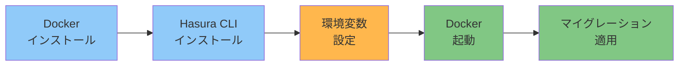

# Backend環境構築

ローカルでHasura開発を行うための環境を構築します。

## 前提条件

- macOS / Linux / Windows（WSL2推奨）
- インターネット接続

## セットアップの流れ



**所要時間**: 約30分

---

## Step 1: Docker Desktop のインストール

### 1.1 インストール

```bash
# macOS (Homebrew)
brew install --cask docker

# または公式サイトからダウンロード
# https://www.docker.com/products/docker-desktop
```

**Windows / Linux**: 公式サイトから Docker Desktop をダウンロード

### 1.2 起動確認

```bash
docker --version
# 期待される出力: Docker version 24.x.x

docker compose version
# 期待される出力: Docker Compose version v2.x.x
```

---

## Step 2: Hasura CLI のインストール

### 2.1 インストール

```bash
# macOS / Linux
curl -L https://github.com/hasura/graphql-engine/raw/stable/cli/get.sh | bash

# インストール先を指定する場合
mkdir -p ~/bin
curl -L https://github.com/hasura/graphql-engine/raw/stable/cli/get.sh | INSTALL_PATH=~/bin bash
```

### 2.2 PATH設定（必要に応じて）

```bash
# ~/.zshrc または ~/.bashrc に追加
export PATH="$HOME/bin:$PATH"

# 反映
source ~/.zshrc  # または source ~/.bashrc
```

### 2.3 確認

```bash
hasura version
# 期待される出力:
# hasura cli: v2.x.x
```

---

## Step 3: 環境変数の設定

### 3.1 `.env` ファイルの作成

```bash
cd backend
cp .env.example .env
```

### 3.2 `.env` の編集

```bash
# エディタで開く
vim .env  # または code .env
```

最低限、以下を設定:

```env
# PostgreSQL
POSTGRES_PASSWORD=your_secure_password_here

# Hasura
HASURA_GRAPHQL_ADMIN_SECRET=your_admin_secret_here

# Firebase (後で設定)
HASURA_GRAPHQL_JWT_SECRET={"type":"RS256",...}
```

**重要**: `POSTGRES_PASSWORD` と `HASURA_GRAPHQL_ADMIN_SECRET` は強力なパスワードに変更してください。

```bash
# ランダムパスワード生成例
openssl rand -hex 32
```

### 3.3 `config.yaml` の設定

```bash
cd hasura
cp config.yaml.example config.yaml
```

`config.yaml` を編集:

```yaml
version: 3
endpoint: http://localhost:8080
admin_secret: your_admin_secret_here  # .env と同じ値
metadata_directory: metadata
actions:
  kind: synchronous
  handler_webhook_baseurl: http://localhost:3000
```

---

## Step 4: Docker サービスの起動

### 4.1 サービス起動

```bash
cd backend
docker compose up -d
```

**出力例**:
```
[+] Running 3/3
 ✔ Network backend_default      Created
 ✔ Container backend-postgres-1 Started
 ✔ Container backend-hasura-1   Started
```

### 4.2 起動確認

```bash
docker compose ps
```

**期待される出力**:
```
NAME                  STATUS         PORTS
backend-hasura-1      Up             0.0.0.0:8080->8080/tcp
backend-postgres-1    Up             5432/tcp
```

### 4.3 ログ確認

```bash
# Hasura ログ
docker compose logs -f hasura

# PostgreSQL ログ
docker compose logs -f postgres
```

正常に起動していれば、以下のようなログが出力されます:

```
hasura-1    | {"type":"startup","timestamp":"...","level":"info","detail":{"kind":"server_configuration"}}
```

---

## Step 5: Hasura Console へのアクセス

ブラウザで以下にアクセス:

```
http://localhost:8080/console
```

Admin Secret を入力してログイン（`.env` で設定した値）。

**注意**: このプロジェクトでは、Hasura CLI Console (`localhost:9695`) に CORS エラーがあるため、**Server Console (`localhost:8080/console`)** を使用します。

---

## Step 6: マイグレーションの適用

### 6.1 マイグレーション適用

```bash
cd backend/hasura
hasura migrate apply --database-name default
```

**期待される出力**:
```
INFO Migrations applied
INFO Applied 6 migrations
```

### 6.2 メタデータ適用

```bash
hasura metadata apply
```

### 6.3 確認

Hasura Console (`http://localhost:8080/console`) の「DATA」タブで、以下のテーブルが表示されることを確認:

- `organizations`
- `users`
- `posts`
- `post_status_types`

---

## Step 7: シードデータの投入（オプション）

テストデータを投入します:

```bash
hasura seed apply --database-name default
```

**投入されるデータ**:
- 組織: 2件（Acme Corp, Beta Inc）
- ユーザー: 5件（admin, tenant_admin x2, user x2）
- 投稿: 13件

### 確認

Hasura Console の「DATA」→「organizations」で、以下のデータが表示されることを確認:

| name | slug | code |
|------|------|------|
| Acme Corp | acme-corp | ACME2024 |
| Beta Inc | beta-inc | BETA2024 |

---

## Step 8: GraphQL 動作確認

### 8.1 Hasura Console で GraphQL クエリ実行

「API」タブに移動し、以下のクエリを実行:

```graphql
query {
  organizations {
    id
    name
    code
  }
}
```

**期待される結果**:
```json
{
  "data": {
    "organizations": [
      {
        "id": "aaaaaaaa-aaaa-aaaa-aaaa-aaaaaaaaaaaa",
        "name": "Acme Corp",
        "code": "ACME2024"
      },
      {
        "id": "bbbbbbbb-bbbb-bbbb-bbbb-bbbbbbbbbbbb",
        "name": "Beta Inc",
        "code": "BETA2024"
      }
    ]
  }
}
```

---

## 完了チェックリスト

- [ ] Docker Desktop インストール済み（`docker --version`）
- [ ] Hasura CLI インストール済み（`hasura version`）
- [ ] `.env` ファイル作成・編集済み
- [ ] `config.yaml` 設定済み
- [ ] `docker compose up -d` でサービス起動成功
- [ ] `http://localhost:8080/console` にアクセス可能
- [ ] マイグレーション適用済み（6件）
- [ ] メタデータ適用済み
- [ ] シードデータ投入済み
- [ ] GraphQL クエリ実行成功

---

## トラブルシューティング

### Docker起動エラー

**エラー**: `Cannot connect to the Docker daemon`

**対処法**:
1. Docker Desktop を起動
2. 数秒待ってから再度 `docker compose up -d`

### Port 8080 が既に使用されている

**エラー**: `Error starting userland proxy: listen tcp4 0.0.0.0:8080: bind: address already in use`

**対処法**:
```bash
# 使用中のプロセスを確認
lsof -i :8080

# または、docker-compose.yml でポート変更
# ports:
#   - "8081:8080"  # 8081に変更
```

### マイグレーション適用エラー

**エラー**: `database: default does not exist on hasura`

**対処法**:
```bash
# Hasura Console で default データベースを Track
# または、メタデータを先に適用
hasura metadata apply
hasura migrate apply --database-name default
```

### Admin Secret が間違っている

**対処法**:
1. `.env` の `HASURA_GRAPHQL_ADMIN_SECRET` を確認
2. `config.yaml` の `admin_secret` を確認
3. 両方が一致していることを確認
4. Docker Compose 再起動: `docker compose restart hasura`

---

## 次のステップ

Backend環境構築が完了したら:

1. **Frontend環境構築** → [frontend-setup.md](frontend-setup.md)
2. **開発ワークフローを理解** → [../development/backend-workflow.md](../development/backend-workflow.md)

---

## 参考リ���ク

- [Docker Desktop ドキュメント](https://docs.docker.com/desktop/)
- [Hasura CLI ドキュメント](https://hasura.io/docs/latest/hasura-cli/overview/)
- [Hasura マイグレーション](https://hasura.io/docs/latest/migrations-metadata-seeds/overview/)
- [トラブルシューティング](../deployment/troubleshooting.md)
