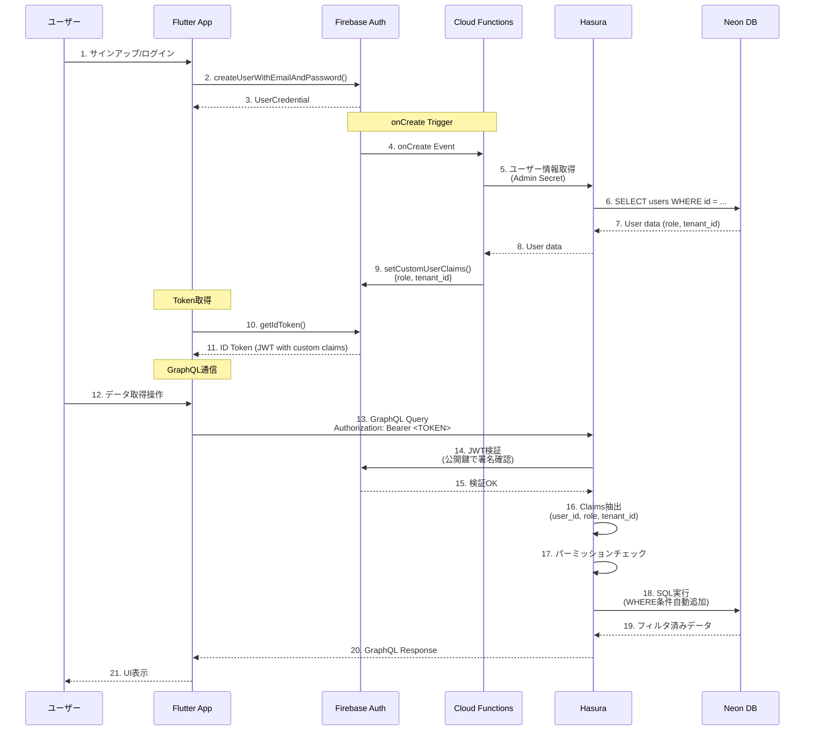
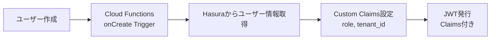
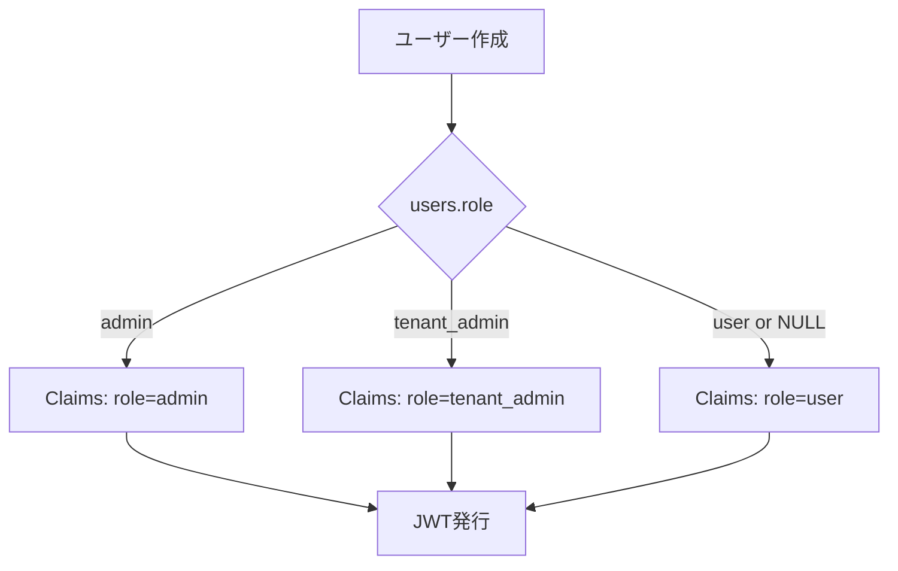
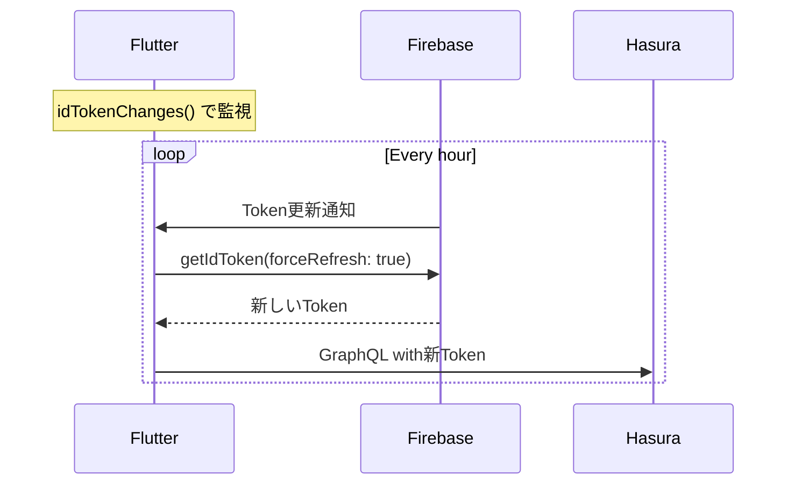

# 認証フロー概要

このドキュメントでは、Firebase Auth と Hasura を組み合わせた認証・認可の仕組みを図で説明します。

## 認証・認可の分離

| 層 | 担当 | 役割 |
|----|------|------|
| **認証（Authentication）** | Firebase Auth | ユーザーが誰かを特定（JWT発行） |
| **認可（Authorization）** | Hasura | ユーザーが何をできるかを制御（パーミッション） |

## 全体フロー



## Custom Claims 設定フロー

Custom Claims（カスタムクレーム）は、JWT に追加情報（`role`, `tenant_id`）を埋め込む仕組みです。



### Custom Claims の内容

```json
{
  "user_id": "firebase-uid-xxx",
  "role": "user",
  "tenant_id": "aaaaaaaa-aaaa-aaaa-aaaa-aaaaaaaaaaaa"
}
```

これらが Hasura に以下のセッション変数として渡されます:
- `X-Hasura-User-Id`
- `X-Hasura-Role`
- `X-Hasura-Tenant-Id`

## ロール設計

### 4つのロール

| ロール | 権限 | 用途 |
|--------|------|------|
| `anonymous` | 公開データのみ閲覧 | 未認証ユーザー |
| `user` | 自分のデータのみ | 一般ユーザー |
| `tenant_admin` | テナント内全データ | 組織管理者 |
| `admin` | 全データ | システム管理者 |

### ロール判定フロー



## マルチテナント分離

Hasura は `X-Hasura-Tenant-Id` を使って、テナント間のデータを自動的に分離します。

```sql
-- User ロールのクエリは自動的に以下のWHERE条件が追加される
SELECT * FROM posts
WHERE tenant_id = 'X-Hasura-Tenant-Id'
  AND user_id = 'X-Hasura-User-Id'
  AND deleted_at IS NULL;
```

## Token リフレッシュフロー

Firebase ID Token は **1時間**で有効期限切れになります。



## 次のステップ

詳細な設計背景は以下を参照:
- [認証・認可の設計](../reference/authentication.md) - Hasura JWT設定、セキュリティ
- [環境構成](environments.md) - Local/Dev/Prod環境の違い
- [マルチテナント設計](../reference/multi-tenancy.md) - テナント分離戦略

実装手順は以下を参照:
- [Flutter環境セットアップ](../getting-started/frontend-setup.md) - Firebase Auth実装
- [Cloud Functions デプロイ](../deployment/cloud-functions-deployment.md) - Custom Claims設定
