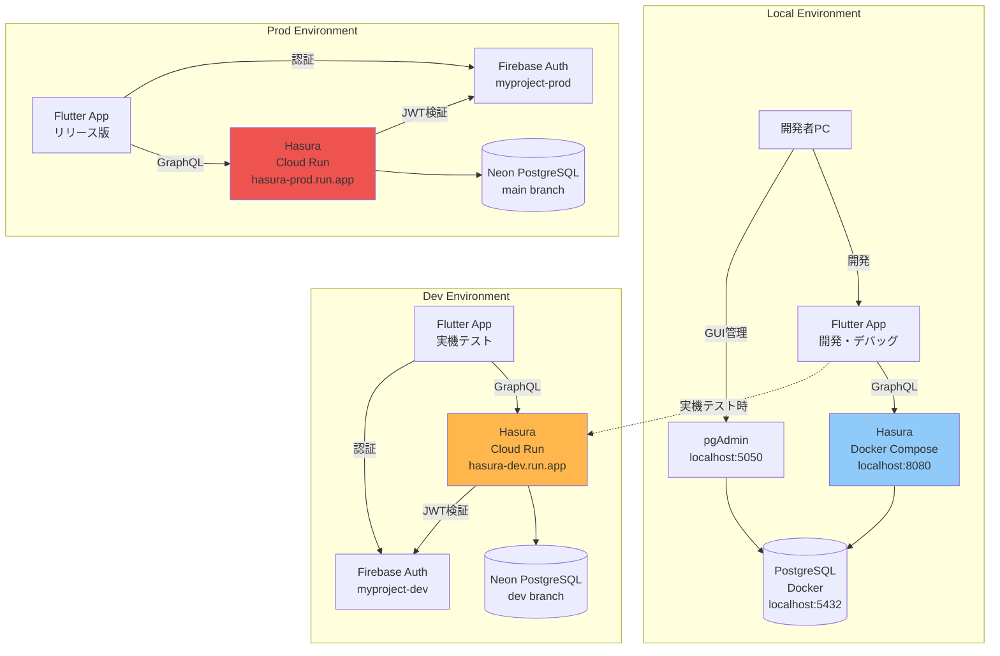
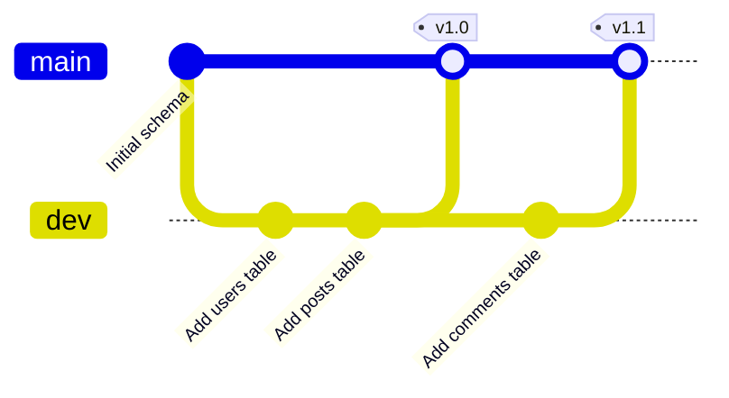
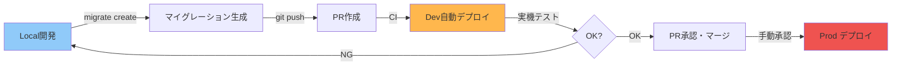

# 環境構成

このドキュメントでは、local/dev/prod 3つの環境の違いを図で説明します。

**詳細なセットアップ手順**:
- Backend環境構築 → [getting-started/backend-setup.md](../getting-started/backend-setup.md)
- Cloud Run デプロイ → [deployment/cloud-run-deployment.md](../deployment/cloud-run-deployment.md)
- CI/CD設定 → [deployment/ci-cd.md](../deployment/ci-cd.md)

---

## 環境一覧

| 環境 | 目的 | DB | Hasura | Firebase Auth |
|------|------|----|---------|----|
| **local** | 開発・migration作成 | Docker PostgreSQL | Docker Compose | dev project |
| **dev** | 統合検証・実機テスト | Neon dev branch | Cloud Run | dev project |
| **prod** | 本番運用 | Neon main branch | Cloud Run | prod project |

---

## 全体構成図



---

## 環境別の設定比較

### 1. Local 環境

**目的**: 開発・マイグレーション作成・安全な実験場

| 項目 | 設定値 |
|------|--------|
| **Hasura** | Docker Compose (`localhost:8080`) |
| **PostgreSQL** | Docker Compose (`localhost:5432`) |
| **Firebase Auth** | `myproject-dev` (API経由) |
| **Console** | ✅ 有効 (`localhost:9695`) |
| **データリセット** | ✅ 可能 (`docker compose down -v`) |
| **オフライン開発** | ✅ 可能 |
| **実機テスト** | ❌ 不可（devを経由） |

**特徴**:
- 完全にローカルで動作（オフラインOK）
- マイグレーション作成の拠点
- 壊しても問題ない

### 2. Dev 環境

**目的**: 統合検証・実機テスト・チーム共有

| 項目 | 設定値 |
|------|--------|
| **Hasura** | Cloud Run (`hasura-dev.run.app`) |
| **PostgreSQL** | Neon dev branch |
| **Firebase Auth** | `myproject-dev` |
| **Console** | ✅ 有効（開発用） |
| **デプロイ** | GitHub Actions（自動） |
| **CORS** | `*`（開発用） |
| **最小インスタンス** | 0（コスト削減） |

**特徴**:
- チーム全体で共有
- CI/CDで自動デプロイ
- 実機テスト可能

### 3. Prod 環境

**目的**: 本番運用

| 項目 | 設定値 |
|------|--------|
| **Hasura** | Cloud Run (`hasura-prod.run.app`) |
| **PostgreSQL** | Neon main branch |
| **Firebase Auth** | `myproject-prod` |
| **Console** | ❌ 無効（セキュリティ） |
| **デプロイ** | 手動承認必須 |
| **CORS** | 本番ドメインのみ |
| **最小インスタンス** | 1以上（レスポンス速度確保） |

**特徴**:
- 安定性最優先
- 承認なしの変更禁止
- 監査ログ有効

---

## Firebase プロジェクト分離

### プロジェクト構成

| 環境 | Firebase Project ID | 用途 |
|------|-------------------|------|
| **local** | `myproject-dev` | 開発用ユーザー |
| **dev** | `myproject-dev` | 開発・テスト用ユーザー |
| **prod** | `myproject-prod` | 本番ユーザー |

### JWT設定の違い

**Dev環境**:
```json
{
  "issuer": "https://securetoken.google.com/myproject-dev",
  "audience": "myproject-dev"
}
```

**Prod環境**:
```json
{
  "issuer": "https://securetoken.google.com/myproject-prod",
  "audience": "myproject-prod"
}
```

---

## Neon ブランチ戦略



| ブランチ | 環境 | マイグレーション適用 |
|---------|------|------------------|
| **main** | Prod | 手動承認後 |
| **dev** | Dev | CI自動適用 |
| **feature-xxx** | （将来）PR プレビュー | PR作成時 |

---

## 開発フロー



詳細は [Backend開発フロー](../development/backend-workflow.md) を参照。

---

## 環境ごとの注意点

### Local
- ✅ 自由に壊せる（Docker volume削除で完全リセット）
- ✅ オフライン開発可能
- ❌ 実機からアクセス不可（dev環境経由）

### Dev
- ✅ チーム全体で共有
- ✅ 実機テスト可能
- ❌ マイグレーションは慎重に（壊れると全員に影響）
- ❌ 本番データは絶対に入れない

### Prod
- ✅ 安定性最優先
- ❌ 直接変更禁止（必ずマイグレーション経由）
- ❌ Hasura Console 無効化
- ❌ テストデータ投入禁止

---

## まとめ

| 環境 | 開発 | 実機テスト | 本番運用 |
|------|------|----------|---------|
| **local** | ✅ | ❌ | ❌ |
| **dev** | ⚠️（共有） | ✅ | ❌ |
| **prod** | ❌ | ❌ | ✅ |

---

## 次のステップ

- **初回セットアップ**: [getting-started/README.md](../getting-started/README.md)
- **Backend環境構築**: [getting-started/backend-setup.md](../getting-started/backend-setup.md)
- **Cloud Run デプロイ**: [deployment/cloud-run-deployment.md](../deployment/cloud-run-deployment.md)
