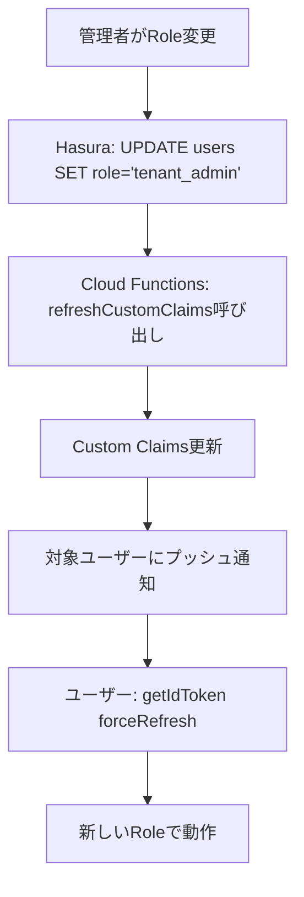

# 認証・認可の設計

このドキュメントでは、認証・認可の設計判断と技術的背景を説明します。

**システム全体のフローは**: [overview/authentication-flow.md](../overview/authentication-flow.md) を参照してください。

---

## 設計原則

### 1. 認証と認可の分離

**原則**: 認証（Authentication）と認可（Authorization）を明確に分離する。

| 層 | 担当 | 責務 |
|----|------|------|
| **認証** | Firebase Auth | ユーザーが誰かを特定し、JWT を発行 |
| **認可** | Hasura Permissions | ユーザーが何をできるかを制御 |

**理由**:
- Firebase Auth: 認証に特化したマネージドサービス（多要素認証、SNS連携が容易）
- Hasura: データアクセス制御に特化（行レベル、カラムレベルのパーミッション）
- 各サービスが得意分野に集中することで、保守性とセキュリティが向上

### 2. JWT を真実の情報源とする

**原則**: ユーザーの `role` と `tenant_id` は JWT (Custom Claims) に埋め込み、Hasura はそれを信頼する。

**理由**:
- 毎リクエストで DB を参照する必要がない（パフォーマンス向上）
- Hasura はステートレスに動作可能
- JWT の署名検証により改ざん防止

**トレードオフ**:
- ❌ Role変更時に即座に反映されない（Token有効期限: 1時間）
- ✅ 強制リフレッシュ機能で対応可能（`getIdToken(forceRefresh: true)`）

---

## Hasura JWT 設定

### JWT Secret 設定

Firebase Auth で発行された JWT を Hasura が検証するための設定。

```json
{
  "type": "RS256",
  "jwk_url": "https://www.googleapis.com/service_accounts/v1/jwk/securetoken@system.gserviceaccount.com",
  "issuer": "https://securetoken.google.com/hasura-flutter-dev",
  "audience": "hasura-flutter-dev",
  "claims_map": {
    "x-hasura-allowed-roles": ["user", "tenant_admin", "admin"],
    "x-hasura-default-role": "user",
    "x-hasura-user-id": "user_id",
    "x-hasura-tenant-id": "tenant_id",
    "x-hasura-role": "role"
  }
}
```

### 設定項目の説明

| 項目 | 説明 |
|------|------|
| `type` | 署名アルゴリズム（RS256 = RSA + SHA256） |
| `jwk_url` | Firebase の公開鍵取得URL |
| `issuer` | JWT発行者（Firebase Project固有） |
| `audience` | JWT受信者（Firebase Project ID） |
| `claims_map` | Custom Claims → Hasura Session Variables へのマッピング |

### 環境別の設定

Dev と Prod で `issuer` と `audience` が異なります:

**Dev環境** (`hasura-flutter-dev`):
```json
{
  "issuer": "https://securetoken.google.com/hasura-flutter-dev",
  "audience": "hasura-flutter-dev"
}
```

**Prod環境** (`hasura-flutter-prod`):
```json
{
  "issuer": "https://securetoken.google.com/hasura-flutter-prod",
  "audience": "hasura-flutter-prod"
}
```

---

## ロール設計

### ロール一覧と権限

| ロール | アクセス範囲 | 削除済みデータ | 用途 |
|--------|------------|------------|------|
| `anonymous` | 公開データのみ | ❌ 不可 | 未認証ユーザー |
| `user` | 自分のデータ | ❌ 不可 | 一般ユーザー |
| `tenant_admin` | テナント内全データ | ✅ 可能 | 組織管理者 |
| `admin` | 全テナントのデータ | ✅ 可能 | システム管理者 |

### ロール判定ロジック

```javascript
// Cloud Functions (setCustomClaimsOnCreate)
const role = userData.role || 'user'; // DBに保存されているrole

await admin.auth().setCustomUserClaims(uid, {
  role: role,
  tenant_id: userData.tenant_id
});
```

**デフォルト値**: `users.role` が NULL の場合は `user` ロール

---

## Hasura パーミッション設計

### 基本パターン

#### 1. User ロール（自分のデータのみ）

```json
{
  "filter": {
    "_and": [
      {"tenant_id": {"_eq": "X-Hasura-Tenant-Id"}},
      {"user_id": {"_eq": "X-Hasura-User-Id"}},
      {"deleted_at": {"_is_null": true}}
    ]
  }
}
```

#### 2. Tenant Admin ロール（テナント内全データ）

```json
{
  "filter": {
    "tenant_id": {"_eq": "X-Hasura-Tenant-Id"}
  }
}
```

**注意**: 削除済みデータも閲覧可能（`deleted_at` フィルタなし）

#### 3. Admin ロール（全データ）

```json
{
  "filter": {}
}
```

### カラムレベルのパーミッション

すべてのロールで、以下のカラムは**更新不可**:
- `id` (主キー)
- `created_at`, `created_by`
- `tenant_id` (テナント移動防止)

---

## Custom Claims 更新戦略

### 問題点

Firebase ID Token は **1時間**キャッシュされるため、Custom Claims を更新しても即座に反映されません。

### 解決策

#### 1. クライアント側で強制リフレッシュ

```dart
// Role変更後
await FirebaseAuth.instance.currentUser?.getIdToken(true); // forceRefresh
```

#### 2. サーバ側でリフレッシュ指示（将来実装）

Cloud Functions で Admin SDK を使い、特定ユーザーのトークンを無効化:

```javascript
await admin.auth().revokeRefreshTokens(uid);
```

### 推奨フロー



---

## セキュリティベストプラクティス

### 1. JWT検証の確認

**重要**: Hasura が JWT を正しく検証していることを確認する。

```bash
# 無効なトークンでリクエスト
curl -X POST "https://hasura-dev.run.app/v1/graphql" \
  -H "Content-Type: application/json" \
  -H "Authorization: Bearer invalid_token" \
  -d '{"query": "{ users { id } }"}'

# 期待される結果: 401 Unauthorized または JWT validation failed
```

### 2. パーミッションテスト

すべてのロールで、以下をテスト:
- ✅ 自分のデータは取得できる
- ❌ 他人のデータは取得できない
- ❌ 他テナントのデータは取得できない
- ❌ 削除済みデータは取得できない（tenant_admin/admin除く）

### 3. Admin Secret の保護

**絶対にクライアントに含めない**:
- ❌ Flutter アプリに埋め込む
- ❌ 環境変数ファイル（`.env`）をコミット

**安全な管理方法**:
- ✅ Secret Manager（Cloud Run）
- ✅ GitHub Secrets（CI/CD）
- ✅ ローカルでは `.env`（gitignore済み）

### 4. CORS 設定

Dev環境では `*` も許容されるが、Prod では厳密に制限:

```bash
HASURA_GRAPHQL_CORS_DOMAIN=https://yourdomain.com
```

---

## トレードオフと制約

### Custom Claims のサイズ制限

Firebase Custom Claims は **1000バイト**が上限。

現在の設計:
```json
{
  "role": "tenant_admin",           // ~20 bytes
  "tenant_id": "uuid-xxx",          // ~40 bytes
  "user_id": "firebase-uid"         // ~30 bytes
}
// 合計: ~90 bytes （余裕あり）
```

将来的に追加できる情報:
- `organization_name`
- `permissions` (配列)
- `feature_flags`

### Token有効期限とリアルタイム性

**制約**: Role変更後、最大1時間反映されない

**対応策**:
1. 重要な変更時は強制リフレッシュ
2. 管理画面でRole変更時にプッシュ通知
3. または、サーバ側でトークン無効化

---

## 参考資料

- [Firebase Auth ドキュメント](https://firebase.google.com/docs/auth)
- [Hasura JWT認証](https://hasura.io/docs/latest/auth/authentication/jwt/)
- [Custom Claims](https://firebase.google.com/docs/auth/admin/custom-claims)
- [認証フロー図](../overview/authentication-flow.md)
