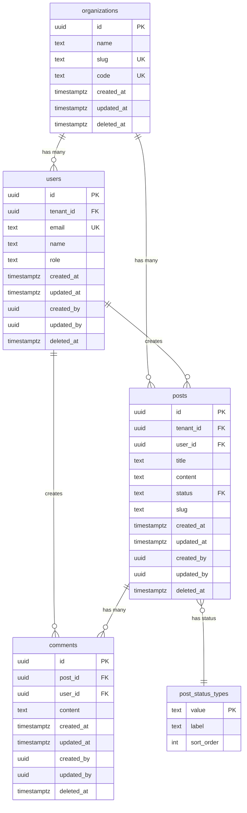

# データベース設計

このドキュメントでは、本プロジェクトのデータベース設計規約と、具体的なテーブル設計例を示します。

## 設計規約まとめ

| 項目 | 規約 | 例 |
|------|------|-----|
| **主キー** | UUID v7 | `id UUID PRIMARY KEY` |
| **外部キー** | UUID + REFERENCES | `user_id UUID REFERENCES users(id)` |
| **タイムスタンプ** | TIMESTAMPTZ (UTC) | `created_at TIMESTAMPTZ DEFAULT NOW()` |
| **監査カラム** | created_at, updated_at, created_by, updated_by | 全テーブルに含める |
| **ソフトデリート** | deleted_at TIMESTAMPTZ | NULL = 有効、値あり = 削除済み |
| **命名規則** | snake_case | `blog_posts`, `user_id` |
| **Enum** | lookup テーブル | `status TEXT REFERENCES status_types(value)` |
| **マルチテナント** | tenant_id UUID | `tenant_id UUID REFERENCES organizations(id)` |
| **インデックス** | PK, FK, 検索条件, created_at | `CREATE INDEX idx_posts_user_id ON posts(user_id)` |

---

## ER図（Entity Relationship Diagram）



---

## 基本テーブル設計

### 1. `organizations`（組織・テナント）

マルチテナント対応のための組織テーブル。

```sql
CREATE TABLE organizations (
  id UUID PRIMARY KEY DEFAULT uuid_generate_v7(),
  name TEXT NOT NULL,
  slug TEXT UNIQUE NOT NULL,  -- URL用（例: acme-corp）
  code VARCHAR(50) UNIQUE NOT NULL,  -- 組織コード（例: ACME2024）
  created_at TIMESTAMPTZ NOT NULL DEFAULT NOW(),
  updated_at TIMESTAMPTZ NOT NULL DEFAULT NOW(),
  deleted_at TIMESTAMPTZ
);

-- インデックス
CREATE INDEX idx_organizations_slug ON organizations(slug) WHERE deleted_at IS NULL;
CREATE INDEX idx_organizations_code ON organizations(code);
CREATE INDEX idx_organizations_created_at ON organizations(created_at DESC);

-- トリガー（updated_at 自動更新）
CREATE TRIGGER update_organizations_updated_at
  BEFORE UPDATE ON organizations
  FOR EACH ROW
  EXECUTE FUNCTION update_updated_at_column();
```

**カラム説明**:
- `id`: プライマリキー（UUID v7）
- `name`: 組織名（例: 株式会社ACME）
- `slug`: URL用のユニークな識別子（例: acme-corp）
- `code`: 組織コード - ユーザー登録時に入力するコード（例: ACME2024）。この値を使って組織への参加を制御する
- `deleted_at`: ソフトデリート用

---

### 2. `users`（ユーザー）

Firebase Auth と同期されるユーザー情報。

```sql
CREATE TABLE users (
  id UUID PRIMARY KEY,  -- Firebase UIDをそのまま使用
  tenant_id UUID NOT NULL REFERENCES organizations(id) ON DELETE CASCADE,
  email TEXT UNIQUE NOT NULL,
  name TEXT,
  role TEXT NOT NULL DEFAULT 'user',  -- 'user' | 'admin'
  created_at TIMESTAMPTZ NOT NULL DEFAULT NOW(),
  updated_at TIMESTAMPTZ NOT NULL DEFAULT NOW(),
  created_by UUID REFERENCES users(id),
  updated_by UUID REFERENCES users(id),
  deleted_at TIMESTAMPTZ
);

-- インデックス
CREATE INDEX idx_users_tenant_id ON users(tenant_id);
CREATE INDEX idx_users_email ON users(email) WHERE deleted_at IS NULL;
CREATE INDEX idx_users_created_at ON users(created_at DESC);

-- トリガー
CREATE TRIGGER update_users_updated_at
  BEFORE UPDATE ON users
  FOR EACH ROW
  EXECUTE FUNCTION update_updated_at_column();
```

**カラム説明**:
- `id`: Firebase Auth の UID（UUID形式）
- `tenant_id`: 所属組織
- `email`: メールアドレス（Firebase Authと同期）
- `role`: ユーザーロール（Firebase Custom Claimsと同期）
- `created_by/updated_by`: 初回は自分自身、管理者による更新時は管理者ID

**注意**:
- `created_by` は初回登録時は自分自身のIDを設定
- 管理者が他ユーザーを作成する場合は管理者IDを設定

---

### 3. `post_status_types`（投稿ステータス - lookup）

Enum の代わりに lookup テーブルを使用。

```sql
CREATE TABLE post_status_types (
  value TEXT PRIMARY KEY,
  label TEXT NOT NULL,
  sort_order INT NOT NULL
);

-- 初期データ
INSERT INTO post_status_types (value, label, sort_order) VALUES
  ('draft', '下書き', 1),
  ('published', '公開', 2),
  ('archived', 'アーカイブ', 3);
```

**利点**:
- ラベルの多言語化対応が容易
- 値の追加・削除が柔軟
- GraphQL でも型安全に扱える

---

### 4. `posts`（投稿）

ブログ投稿などのコンテンツテーブル。

```sql
CREATE TABLE posts (
  id UUID PRIMARY KEY DEFAULT uuid_generate_v7(),
  tenant_id UUID NOT NULL REFERENCES organizations(id) ON DELETE CASCADE,
  user_id UUID NOT NULL REFERENCES users(id) ON DELETE CASCADE,
  title TEXT NOT NULL,
  content TEXT NOT NULL,
  status TEXT NOT NULL DEFAULT 'draft' REFERENCES post_status_types(value),
  slug TEXT NOT NULL,
  created_at TIMESTAMPTZ NOT NULL DEFAULT NOW(),
  updated_at TIMESTAMPTZ NOT NULL DEFAULT NOW(),
  created_by UUID NOT NULL REFERENCES users(id),
  updated_by UUID NOT NULL REFERENCES users(id),
  deleted_at TIMESTAMPTZ,

  -- テナント内でslugがユニーク（削除済みを除外）
  CONSTRAINT posts_tenant_slug_unique UNIQUE (tenant_id, slug)
);

-- インデックス
CREATE INDEX idx_posts_tenant_id ON posts(tenant_id);
CREATE INDEX idx_posts_user_id ON posts(user_id);
CREATE INDEX idx_posts_status ON posts(status);
CREATE INDEX idx_posts_created_at ON posts(created_at DESC);

-- 複合インデックス（よく使うクエリパターン）
CREATE INDEX idx_posts_tenant_status_created
  ON posts(tenant_id, status, created_at DESC)
  WHERE deleted_at IS NULL;

-- トリガー
CREATE TRIGGER update_posts_updated_at
  BEFORE UPDATE ON posts
  FOR EACH ROW
  EXECUTE FUNCTION update_updated_at_column();
```

**カラム説明**:
- `slug`: URL用の識別子（例: my-first-post）
- `status`: 投稿ステータス（draft/published/archived）

**複合ユニーク制約**:
- `tenant_id` + `slug` でユニーク（削除済みは除外）
- 同じ組織内で同じslugは使えない

---

### 5. `comments`（コメント）

投稿へのコメント。

```sql
CREATE TABLE comments (
  id UUID PRIMARY KEY DEFAULT uuid_generate_v7(),
  post_id UUID NOT NULL REFERENCES posts(id) ON DELETE CASCADE,
  user_id UUID NOT NULL REFERENCES users(id) ON DELETE CASCADE,
  content TEXT NOT NULL,
  created_at TIMESTAMPTZ NOT NULL DEFAULT NOW(),
  updated_at TIMESTAMPTZ NOT NULL DEFAULT NOW(),
  created_by UUID NOT NULL REFERENCES users(id),
  updated_by UUID NOT NULL REFERENCES users(id),
  deleted_at TIMESTAMPTZ
);

-- インデックス
CREATE INDEX idx_comments_post_id ON comments(post_id);
CREATE INDEX idx_comments_user_id ON comments(user_id);
CREATE INDEX idx_comments_created_at ON comments(created_at DESC);

-- トリガー
CREATE TRIGGER update_comments_updated_at
  BEFORE UPDATE ON comments
  FOR EACH ROW
  EXECUTE FUNCTION update_updated_at_column();
```

**注意**:
- `tenant_id` は不要（`post_id` 経由で組織が特定できる）
- コメントは投稿に紐づくため、投稿削除時に CASCADE 削除

---

## ヘルパー関数・トリガー

### `updated_at` 自動更新トリガー

```sql
-- 関数定義（1回だけ実行）
CREATE OR REPLACE FUNCTION update_updated_at_column()
RETURNS TRIGGER AS $$
BEGIN
  NEW.updated_at = NOW();
  RETURN NEW;
END;
$$ LANGUAGE plpgsql;

-- 各テーブルにトリガーを設定
CREATE TRIGGER update_organizations_updated_at
  BEFORE UPDATE ON organizations
  FOR EACH ROW
  EXECUTE FUNCTION update_updated_at_column();

-- 他のテーブルも同様に設定
```

### UUID v7 生成関数（拡張が必要な場合）

```sql
-- pg_uuidv7 拡張をインストール（Neonで利用可能か要確認）
-- CREATE EXTENSION IF NOT EXISTS pg_uuidv7;

-- デフォルト値として使用
-- id UUID PRIMARY KEY DEFAULT uuid_generate_v7()
```

**代替案**（拡張が使えない場合）:
- クライアント側で UUID v7 を生成
- または UUID v4 で代替

---

## View（集計・分析用）

### ユーザーごとの投稿数

```sql
CREATE VIEW user_post_counts AS
SELECT
  u.id AS user_id,
  u.tenant_id,
  u.name AS user_name,
  COUNT(p.id) AS post_count,
  COUNT(CASE WHEN p.status = 'published' THEN 1 END) AS published_count
FROM users u
LEFT JOIN posts p ON u.id = p.user_id AND p.deleted_at IS NULL
WHERE u.deleted_at IS NULL
GROUP BY u.id, u.tenant_id, u.name;
```

**Hasuraで使用**:
- このViewをHasuraで追跡（Track）すると、GraphQLクエリで使用可能
```graphql
query {
  user_post_counts(where: {tenant_id: {_eq: "..."}}) {
    user_id
    user_name
    post_count
    published_count
  }
}
```

### 日次投稿統計（Materialized View）

```sql
CREATE MATERIALIZED VIEW daily_post_stats AS
SELECT
  DATE(created_at) AS date,
  tenant_id,
  status,
  COUNT(*) AS post_count
FROM posts
WHERE deleted_at IS NULL
GROUP BY DATE(created_at), tenant_id, status
ORDER BY date DESC;

-- インデックス
CREATE INDEX idx_daily_post_stats_date ON daily_post_stats(date DESC);
CREATE INDEX idx_daily_post_stats_tenant ON daily_post_stats(tenant_id);

-- リフレッシュ（定期実行バッチで）
REFRESH MATERIALIZED VIEW daily_post_stats;
```

**Materialized View の更新**:
- Cloud Run Jobs または Cloud Scheduler で定期実行
- 例: 毎日深夜に `REFRESH MATERIALIZED VIEW`

---

## インデックス戦略

### 基本方針
1. **プライマリキー**: 自動作成
2. **外部キー**: 必ずインデックス作成
3. **検索条件**: WHERE句で頻繁に使うカラム
4. **ソート**: ORDER BY で使うカラム（特に `created_at`）
5. **複合インデックス**: よくあるクエリパターンに合わせる

### 複合インデックスの例

```sql
-- テナント + ステータス + 作成日時（降順）
CREATE INDEX idx_posts_tenant_status_created
  ON posts(tenant_id, status, created_at DESC)
  WHERE deleted_at IS NULL;

-- このクエリが高速化される
-- SELECT * FROM posts
-- WHERE tenant_id = '...' AND status = 'published' AND deleted_at IS NULL
-- ORDER BY created_at DESC;
```

### 部分インデックス（Partial Index）

ソフトデリートを使う場合、削除済みを除外するインデックスが有効:

```sql
CREATE INDEX idx_users_email
  ON users(email)
  WHERE deleted_at IS NULL;
```

---

## マルチテナント設計のベストプラクティス

### 1. 全テーブルに `tenant_id` を含める

例外:
- `organizations` テーブル自体
- lookup テーブル（`post_status_types` 等）
- グローバルな設定テーブル

### 2. Hasura パーミッションで自動フィルタ

**user ロール**: 自分が作成したデータのみ
```json
{
  "filter": {
    "_and": [
      {"tenant_id": {"_eq": "X-Hasura-Tenant-Id"}},
      {"user_id": {"_eq": "X-Hasura-User-Id"}},
      {"deleted_at": {"_is_null": true}}
    ]
  }
}
```

**tenant_admin ロール**: テナント内の全データ（削除済み含む）
```json
{
  "filter": {
    "tenant_id": {"_eq": "X-Hasura-Tenant-Id"}
  }
}
```

**admin ロール**: 全テナントの全データ
```json
{
  "filter": {}
}
```

### 3. 複合ユニーク制約

グローバルでユニークにするのではなく、テナント内でユニークに:

```sql
-- ❌ グローバルユニーク（マルチテナントでは不適切）
-- UNIQUE (slug)

-- ✅ テナント内でユニーク
UNIQUE (tenant_id, slug)
```

### 4. リレーションのテナント整合性チェック（オプション）

```sql
-- posts.user_id が同じテナントのユーザーであることを保証
ALTER TABLE posts
ADD CONSTRAINT posts_user_tenant_check
CHECK (
  (SELECT tenant_id FROM users WHERE id = user_id) = tenant_id
);
```

**注意**: この制約はパフォーマンスに影響する可能性があるため、アプリケーション層で保証する方が良い場合もあります。

---

## マイグレーション管理

### ファイル命名規則

Hasura CLI によるマイグレーション生成:

```bash
# テーブル作成
hasura migrate create "create_organizations_table" --from-server

# カラム追加
hasura migrate create "add_slug_to_organizations" --from-server

# インデックス追加
hasura migrate create "add_index_posts_tenant_status" --from-server
```

生成されるファイル:
```
backend/hasura/migrations/
├── 1640000001_create_organizations_table/
│   └── up.sql
│   └── down.sql
├── 1640000002_create_users_table/
│   └── up.sql
│   └── down.sql
└── ...
```

### `up.sql` / `down.sql` の例

**up.sql**:
```sql
CREATE TABLE organizations (
  id UUID PRIMARY KEY DEFAULT uuid_generate_v7(),
  name TEXT NOT NULL,
  slug TEXT UNIQUE NOT NULL,
  created_at TIMESTAMPTZ NOT NULL DEFAULT NOW(),
  updated_at TIMESTAMPTZ NOT NULL DEFAULT NOW(),
  deleted_at TIMESTAMPTZ
);
```

**down.sql**:
```sql
DROP TABLE IF EXISTS organizations;
```

---

## シードデータ

### テスト用データの投入

```bash
# シード作成
hasura seed create initial_data --from-table organizations
hasura seed create initial_data --from-table post_status_types
```

`backend/hasura/seeds/default/initial_data.sql`:
```sql
-- Lookup データ
INSERT INTO post_status_types (value, label, sort_order) VALUES
  ('draft', '下書き', 1),
  ('published', '公開', 2),
  ('archived', 'アーカイブ', 3);

-- テスト組織
INSERT INTO organizations (id, name, slug) VALUES
  ('01234567-89ab-cdef-0123-456789abcdef', 'Test Organization', 'test-org');

-- テストユーザー（Firebase UIDと一致させる）
INSERT INTO users (id, tenant_id, email, name, role, created_by, updated_by) VALUES
  ('firebase-uid-123', '01234567-89ab-cdef-0123-456789abcdef', 'test@example.com', 'Test User', 'user', 'firebase-uid-123', 'firebase-uid-123');
```

**適用**:
```bash
hasura seed apply
```

---

## パフォーマンス最適化

### 1. EXPLAIN ANALYZE で実行計画確認

```sql
EXPLAIN ANALYZE
SELECT * FROM posts
WHERE tenant_id = '...' AND status = 'published'
ORDER BY created_at DESC
LIMIT 10;
```

### 2. インデックスの効果測定

```sql
-- インデックス使用状況
SELECT
  schemaname,
  tablename,
  indexname,
  idx_scan,
  idx_tup_read,
  idx_tup_fetch
FROM pg_stat_user_indexes
WHERE schemaname = 'public'
ORDER BY idx_scan;
```

### 3. N+1 問題の回避

Hasuraのリレーションを活用:
```graphql
query {
  posts {
    id
    title
    user {  # 自動でJOINされる（N+1にならない）
      id
      name
    }
  }
}
```

---

## まとめ

このデータベース設計により、以下を実現します:

- **UUID v7**: 時系列ソート可能な主キー
- **監査カラム**: 変更履歴の追跡
- **ソフトデリート**: データの復元可能性
- **マルチテナント**: 初期から対応
- **lookup テーブル**: 柔軟な Enum 管理
- **インデックス**: クエリパフォーマンス最適化
- **View**: 集計処理の効率化

次は [開発フロー](development-flow.md) で実際の開発手順を確認してください。
