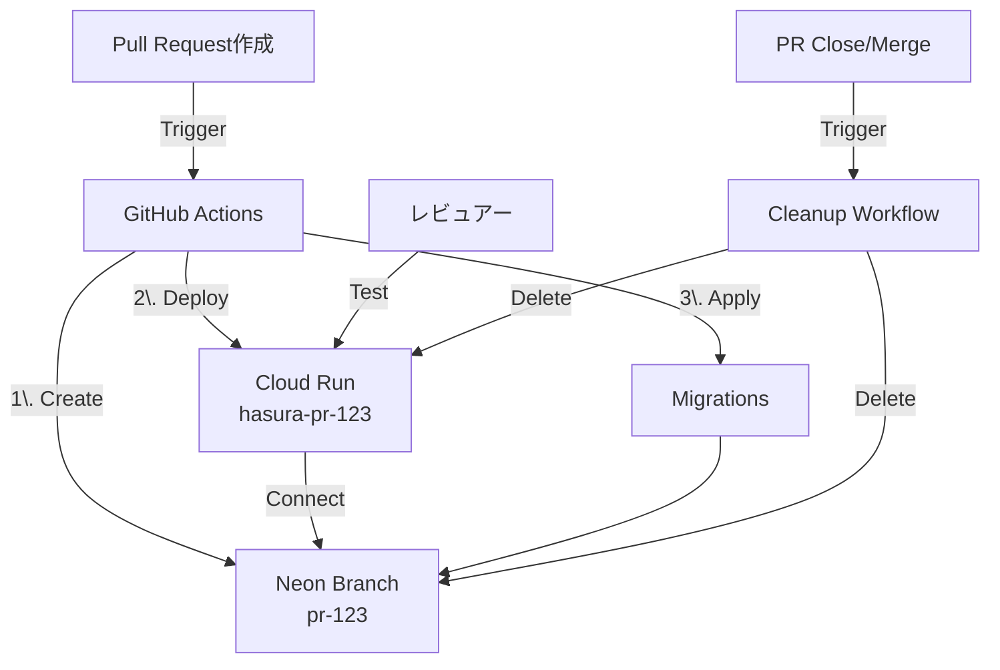
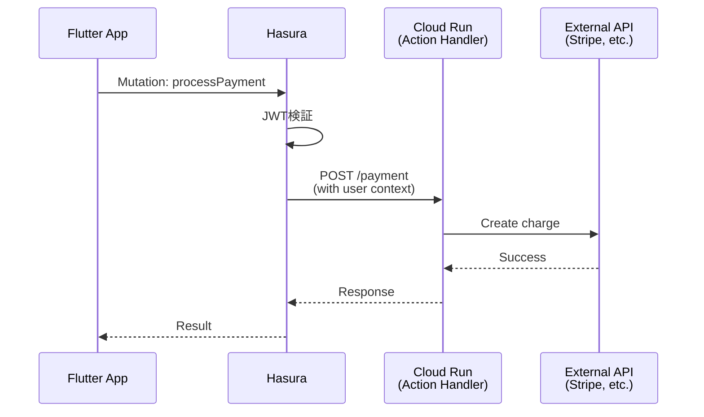

# 将来拡張

このドキュメントでは、現在は実装しないが、将来的に検討・追加したい機能をまとめます。

## 実装優先度

| 優先度 | 説明 | タイミング |
|--------|------|----------|
| **High** | 近い将来必須になる機能 | 3-6ヶ月以内 |
| **Medium** | あると便利だが必須ではない | 6-12ヶ月 |
| **Low** | 将来の可能性として記録 | 12ヶ月以降 |

---

## High Priority

### 1. Neon Preview Branch による PR レビュー環境

**目的**: PRごとに独立したDB環境を自動作成し、レビュー時に実際のデータで動作確認

**構成図**:


**実装方針**:

1. **Neon Branch 自動作成**:
   ```bash
   # GitHub Actions で実行
   BRANCH_NAME="pr-${{ github.event.pull_request.number }}"

   # Neon CLI で branch 作成
   neon branches create \
     --name "$BRANCH_NAME" \
     --parent dev \
     --project-id $PROJECT_ID

   # 接続文字列取得
   DATABASE_URL=$(neon connection-string "$BRANCH_NAME")
   ```

2. **Cloud Run 一時デプロイ**:
   ```bash
   gcloud run deploy "hasura-pr-$PR_NUMBER" \
     --image hasura/graphql-engine:latest \
     --set-env-vars "HASURA_GRAPHQL_DATABASE_URL=$DATABASE_URL" \
     --tag "pr-$PR_NUMBER"
   ```

3. **マイグレーション適用**:
   ```bash
   hasura migrate apply --endpoint "https://hasura-pr-$PR_NUMBER-xxx.run.app"
   hasura metadata apply
   hasura seed apply  # テストデータ投入
   ```

4. **PR コメントに URL 追加**:
   ```yaml
   - name: Comment PR
     uses: actions/github-script@v6
     with:
       script: |
         github.rest.issues.createComment({
           issue_number: context.issue.number,
           owner: context.repo.owner,
           repo: context.repo.repo,
           body: '🚀 Preview環境:\n- Hasura: https://hasura-pr-...\n- GraphQL: https://hasura-pr-.../v1/graphql'
         })
   ```

5. **クリーンアップ（PR Close時）**:
   ```bash
   # Neon branch 削除
   neon branches delete "pr-$PR_NUMBER"

   # Cloud Run サービス削除
   gcloud run services delete "hasura-pr-$PR_NUMBER" --quiet
   ```

**メリット**:
- レビュアーが実際の環境でテスト可能
- マイグレーションの動作確認が容易
- 本番・dev環境を汚さない

**コスト**:
- Neon: ブランチは無料枠内（数時間〜数日の利用）
- Cloud Run: リクエストがなければ最小コスト

**参考**:
- [Neon Branching](https://neon.tech/docs/introduction/branching)
- [Neon CLI](https://neon.tech/docs/reference/cli-branches)

---

### 2. サーバサイドユーザー同期（Cloud Functions）

**目的**: クライアント発火の同期を補完し、確実にユーザーを同期

**現状**:
- クライアント発火の idempotent upsert
- ネットワークエラー時の再試行

**問題**:
- ネットワーク不安定時に同期漏れの可能性
- レースコンディション（複数デバイス同時ログイン）

**解決策**: Firebase Cloud Functions の `onCreate` トリガー

**実装**:
```javascript
// functions/src/index.ts
import * as functions from 'firebase-functions';
import * as admin from 'firebase-admin';
import fetch from 'node-fetch';

admin.initializeApp();

export const onUserCreate = functions.auth.user().onCreate(async (user) => {
  const hasuraEndpoint = process.env.HASURA_ENDPOINT;
  const adminSecret = process.env.HASURA_ADMIN_SECRET;

  const mutation = `
    mutation UpsertUser($id: uuid!, $email: String!) {
      insert_users_one(
        object: { id: $id, email: $email }
        on_conflict: { constraint: users_pkey, update_columns: [email, updated_at] }
      ) {
        id
      }
    }
  `;

  const response = await fetch(`${hasuraEndpoint}/v1/graphql`, {
    method: 'POST',
    headers: {
      'Content-Type': 'application/json',
      'x-hasura-admin-secret': adminSecret,
    },
    body: JSON.stringify({
      query: mutation,
      variables: {
        id: user.uid,
        email: user.email,
      },
    }),
  });

  const data = await response.json();

  if (data.errors) {
    console.error('Failed to sync user:', data.errors);
    throw new functions.https.HttpsError('internal', 'User sync failed');
  }

  console.log('User synced:', user.uid);
});
```

**デプロイ**:
```bash
cd functions
npm install
firebase deploy --only functions
```

**メリット**:
- クライアントの状態に依存しない
- 確実に同期される
- クライアント側のコード簡素化

**デメリット**:
- Firebase Functions のコスト（呼び出し回数課金）
- レイテンシ増加（わずか）

---

## Medium Priority

### 3. Hasura Actions（カスタムビジネスロジック）

**目的**: Hasura だけでは実現できない複雑な処理を外部APIで実装

**ユースケース**:
- 決済処理（Stripe連携）
- 外部API呼び出し（SendGrid、Twilio等）
- 複雑な集計・レポート生成
- ファイル処理（画像リサイズ等）

**構成図**:


**実装例**:

1. **Action 定義（Hasura）**:
   ```yaml
   # metadata/actions.yaml
   actions:
     - name: processPayment
       definition:
         kind: synchronous
         handler: https://actions.example.com/payment
       permissions:
         - role: user
   ```

2. **Handler 実装（Cloud Run）**:
   ```typescript
   // actions/src/index.ts
   import express from 'express';
   import Stripe from 'stripe';

   const app = express();
   const stripe = new Stripe(process.env.STRIPE_SECRET_KEY);

   app.post('/payment', async (req, res) => {
     const { session_variables, input } = req.body;
     const userId = session_variables['x-hasura-user-id'];

     try {
       const charge = await stripe.charges.create({
         amount: input.amount,
         currency: 'usd',
         source: input.token,
         metadata: { user_id: userId },
       });

       res.json({ charge_id: charge.id, status: charge.status });
     } catch (error) {
       res.status(400).json({ message: error.message });
     }
   });

   app.listen(8080);
   ```

3. **GraphQL から呼び出し**:
   ```graphql
   mutation {
     processPayment(amount: 1000, token: "tok_xxx") {
       charge_id
       status
     }
   }
   ```

**セキュリティ**:
- Cloud Run を Private に設定
- Hasura の Service Account に Invoker 権限付与
- または共有シークレットヘッダで検証

---

### 4. ファイルストレージ連携

**目的**: 画像・動画等のファイルアップロード・配信

**選択肢**:

| サービス | メリット | デメリット |
|---------|---------|-----------|
| **Firebase Storage** | Firebase連携が容易 | GCS より高コスト |
| **Google Cloud Storage** | 安価、CDN連携 | 認証設定が複雑 |
| **Cloudflare R2** | S3互換、無料枠大 | 新しいサービス |

**推奨**: Firebase Storage（初期）→ GCS + CDN（スケール時）

**実装例**:

1. **Flutter でアップロード**:
   ```dart
   import 'package:firebase_storage/firebase_storage.dart';

   final ref = FirebaseStorage.instance.ref('avatars/$userId.jpg');
   await ref.putFile(imageFile);
   final url = await ref.getDownloadURL();

   // Hasura に URL を保存
   await updateUser(id: userId, avatarUrl: url);
   ```

2. **DB テーブル**:
   ```sql
   ALTER TABLE users ADD COLUMN avatar_url TEXT;
   ```

3. **CDN 配信**（GCS の場合）:
   - Cloud CDN を有効化
   - カスタムドメイン設定（`cdn.example.com`）

---

### 5. Feature Flags（機能フラグ）

**目的**: 環境ごとに機能の ON/OFF を切り替え

**現状**: `.env` ファイルで管理

**将来**: DB テーブルで管理 → Hasura 経由で取得

**実装**:

1. **テーブル作成**:
   ```sql
   CREATE TABLE feature_flags (
     key TEXT PRIMARY KEY,
     enabled BOOLEAN NOT NULL DEFAULT false,
     description TEXT,
     created_at TIMESTAMPTZ NOT NULL DEFAULT NOW(),
     updated_at TIMESTAMPTZ NOT NULL DEFAULT NOW()
   );

   INSERT INTO feature_flags (key, enabled, description) VALUES
     ('enable_payments', false, '決済機能の有効化'),
     ('enable_dark_mode', true, 'ダークモード'),
     ('enable_beta_features', false, 'ベータ機能');
   ```

2. **GraphQL で取得**:
   ```graphql
   query {
     feature_flags {
       key
       enabled
     }
   }
   ```

3. **Flutter で使用**:
   ```dart
   class FeatureFlags {
     static bool enablePayments = false;

     static Future<void> load(GraphQLClient client) async {
       final result = await client.query(...);
       final flags = result.data['feature_flags'];
       enablePayments = flags.firstWhere((f) => f['key'] == 'enable_payments')['enabled'];
     }
   }

   // アプリ起動時
   await FeatureFlags.load(client);

   // 使用
   if (FeatureFlags.enablePayments) {
     // 決済機能を表示
   }
   ```

**管理画面**: Hasura Console または Admin 専用画面で ON/OFF 切替

---

### 6. バッチ処理・非同期ジョブ

**目的**: 定期実行・重い処理の非同期化

**ユースケース**:
- 日次レポート生成
- Materialized View のリフレッシュ
- メール一斉送信
- データクリーンアップ（古いログ削除）

**選択肢**:

| サービス | 用途 | 料金 |
|---------|------|------|
| **Cloud Scheduler** | 定期実行（cron） | 無料枠あり |
| **Cloud Run Jobs** | 一回限りの重い処理 | 実行時間課金 |
| **Cloud Tasks** | キューベースの非同期処理 | リクエスト課金 |
| **Eventarc** | イベント駆動処理 | イベント課金 |

**実装例（Cloud Scheduler + Cloud Run Jobs）**:

1. **ジョブ定義**:
   ```typescript
   // jobs/src/refresh-stats.ts
   import { Client } from 'pg';

   const client = new Client({ connectionString: process.env.DATABASE_URL });
   await client.connect();

   await client.query('REFRESH MATERIALIZED VIEW daily_post_stats');
   console.log('Stats refreshed');

   await client.end();
   ```

2. **Cloud Scheduler 設定**:
   ```bash
   gcloud scheduler jobs create http refresh-stats \
     --schedule="0 2 * * *" \
     --uri="https://jobs.example.com/refresh-stats" \
     --http-method=POST \
     --oidc-service-account-email=scheduler@project.iam.gserviceaccount.com
   ```

---

## Low Priority

### 7. GraphQL Persisted Queries

**目的**: クエリ複雑度制限・パフォーマンス向上

**仕組み**:
- クライアントはクエリ本文ではなく、ハッシュ値を送信
- サーバ側で事前登録されたクエリを実行

**メリット**:
- クエリサイズ削減
- 悪意あるクエリの実行を防止
- キャッシュ効率向上

**Hasura での実装**: Hasura Pro または Enterprise プランで利用可能

---

### 8. マルチリージョン対応

**目的**: グローバル展開時のレイテンシ削減

**構成**:
- Cloud Run: 複数リージョンにデプロイ
- Neon: Read Replica を各リージョンに配置
- Cloud CDN: 静的コンテンツ配信

**実装時期**: ユーザー数が10万人を超えたら検討

---

### 9. リアルタイム通知（WebSocket）

**目的**: プッシュ通知・リアルタイムチャット

**選択肢**:
- Hasura Subscriptions（WebSocket）
- Firebase Cloud Messaging（プッシュ通知）
- Firestore（リアルタイムDB）

**実装**:
```graphql
subscription {
  notifications(where: {user_id: {_eq: $userId}, read: {_eq: false}}) {
    id
    message
    created_at
  }
}
```

---

### 10. 監査ログ（Audit Log）

**目的**: 全データ変更の履歴を記録

**実装**:
- PostgreSQL トリガーで `audit_log` テーブルに記録
- または Hasura Event Triggers

**テーブル定義**:
```sql
CREATE TABLE audit_log (
  id UUID PRIMARY KEY DEFAULT uuid_generate_v7(),
  table_name TEXT NOT NULL,
  operation TEXT NOT NULL,  -- INSERT/UPDATE/DELETE
  old_data JSONB,
  new_data JSONB,
  user_id UUID,
  timestamp TIMESTAMPTZ NOT NULL DEFAULT NOW()
);
```

---

## 検討中（未定）

### 11. E2Eテスト自動化

- Playwright または Cypress
- CI で自動実行
- クリティカルパスのみテスト

### 12. パーミッションテストの自動実行（pre-commit hook）

**目的**: コミット前にパーミッションテストを自動実行し、権限設定の破壊的変更を検知

**現状**:
- `test-permissions.js` で手動実行
- メタデータ変更時にテストを忘れる可能性

**実装案**:

1. **Huskyでpre-commit hook設定**:
   ```bash
   npm install --save-dev husky
   npx husky install
   npx husky add .husky/pre-commit "npm run test:permissions"
   ```

2. **package.jsonにスクリプト追加**:
   ```json
   {
     "scripts": {
       "test:permissions": "docker ps | grep hasura && node test-permissions.js || echo 'Skipping: Docker not running'"
     }
   }
   ```

3. **条件付き実行**:
   - metadata変更時のみ実行（`git diff --cached`でチェック）
   - Docker起動中のみ実行
   - 失敗時はコミットを中止

**メリット**:
- 権限設定のバグを早期発見
- レビュー前に自動検証
- CIコストを削減（ローカルで検知）

**デメリット**:
- コミット時間が数秒増加
- Docker未起動時はスキップが必要

**代替案**: GitHub Actions で PR 時に自動実行

**優先度**: Medium（検証PJでは不要だが、本番PJでは有用）

### 13. パフォーマンスモニタリング

- Cloud Monitoring
- Hasura Pro の Analytics
- Flutter アプリの APM（Firebase Performance Monitoring）

### 14. GDPR対応（データエクスポート・削除）

- ユーザーデータの一括エクスポート機能
- 完全削除機能（ソフトデリートではなく物理削除）

---

## まとめ

このドキュメントは、プロジェクトの成長に応じて更新していきます。

**実装の判断基準**:
- **High**: ユーザー体験・開発効率に直接影響
- **Medium**: あると便利だが、回避策がある
- **Low**: 将来の可能性として記録

新しいアイデアがあれば、このドキュメントに追記してください。

---

以上で、検証プロジェクトのドキュメント群が完成しました。次はテンプレートファイルの作成に進みます。
